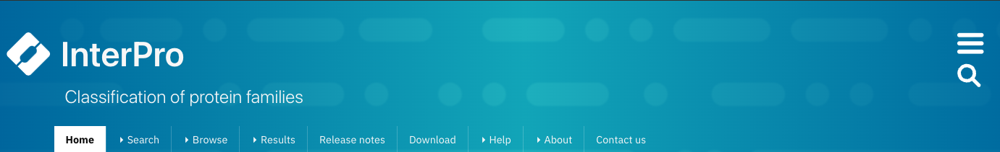
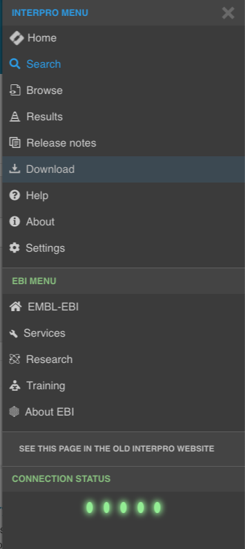
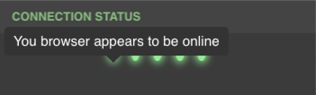
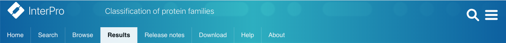

######
Banner
######

The banner is visible at the top of all sections of the website and is
intended to provide a convenient way to access many of key features of the
website.

We will describe various aspects of the navigation banner in this section.

****
Logo
****

The InterPro 7 logo on the right-hand side of the website banner has a dual
purpose. It links to the :doc:`/homepage` and also displays an animation whilst
data is being fetched from servers to indicate that the not all components on
the page being viewed have completely loaded.

**********
Search box
**********

.. image:: images/banner/navigation_search_box.png
  :alt: Banner search field

The *magnifying glass* icon on the left side of website banner can be clicked
to show a text entry component. A search can be triggered by entering some text
and pressing the enter/return key or the clicking the magnifying glass. This is
the same as using the text search in the :doc:`/searchpage`

****************
Settings sidebar
****************

The *hamburger* icon on the right opens the settings sidebar.

The settings sidebar provides another way to access different parts of the
website and is the only way of accessing the settings page.

The **Connection Status** section of the sidebar provides a visual *traffic light*
overview of the status of a number of resources the website relies upon. The
details of what each traffic light represents can be viewed by hovering the
mouse pointer over the light.

***************
Navigation Tabs
***************

The bottom section of the banner contains a set of tabs which link to the
following sections of the website.

Home
====

The **Home** tab links to the :doc:`/homepage`.

Search
======

The **Search** tab links to the :doc:`/searchpage`.

Browse
======

The **Browse** tab links to the :doc:`/browse`.

Results
=======

The **Results** tab links to the :doc:`/results`.

Release Notes
=============

The **Release Notes** tab links to the :doc:`/release_notes`.

Download
========

.. image:: images/banner/navigation_download.png
  :alt: Navigation Download tab

The **Download** tab links to the :doc:`/download`.

Help
====

The **Help** tab links to the :doc:`/help`.

About
=====

The **About** tab links to the :doc:`/about`.
