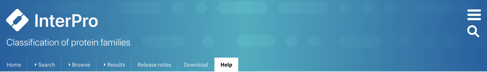

#######################
InterPro website banner
#######################

.. ::browse_feature searchways.html#browse-feature
.. :ref:sequence_search_results searchways.html#sequence-search-results
.. :ref:bulk_download download.html#bulk-download
.. :ref:quick_search searchways.html#quick-search

Every page in InterPro has an identical banner with some handy features described below.

.. _navigation_banner:

**************************
Navigation banner and menu
**************************

The navigation banner contains: 

.. _navigation_menu:

Navigation menu tabs
====================
:doc:`Home </homepage>`, :doc:`Search </searchways>`, :ref:`Browse <browse_feature>`, 
:ref:`Results <sequence_search_results>`, :doc:`/release_notes`, :ref:`Download <bulk_download>`, 
Help, About and Contact us.

Quick search box
================
The magnifying glass icon on the right side of the website banner can be clicked to show a text entry 
component and performs a :ref:`quick_search`.

.. _settings:

Settings sidebar 
================
|hamburger| The hamburger icon on the right opens the settings sidebar.

The settings sidebar provides another way to access different parts of the website and is the only way of accessing the :doc:`settings page </settings>` .

.. |hamburger| image:: /images/banner/navigation_hamburger.png
  :alt: hamburger icon