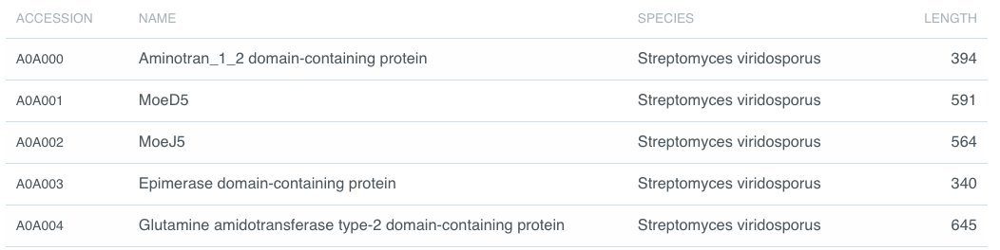
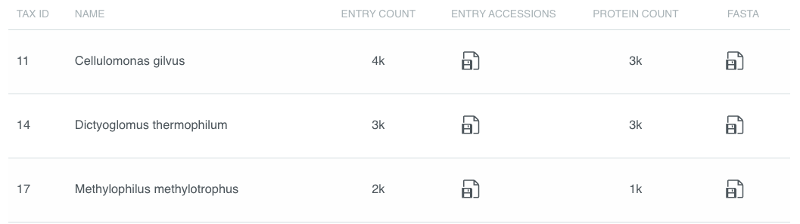
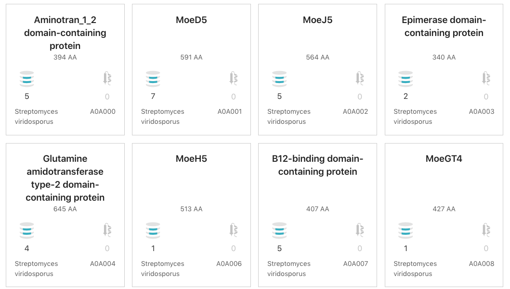
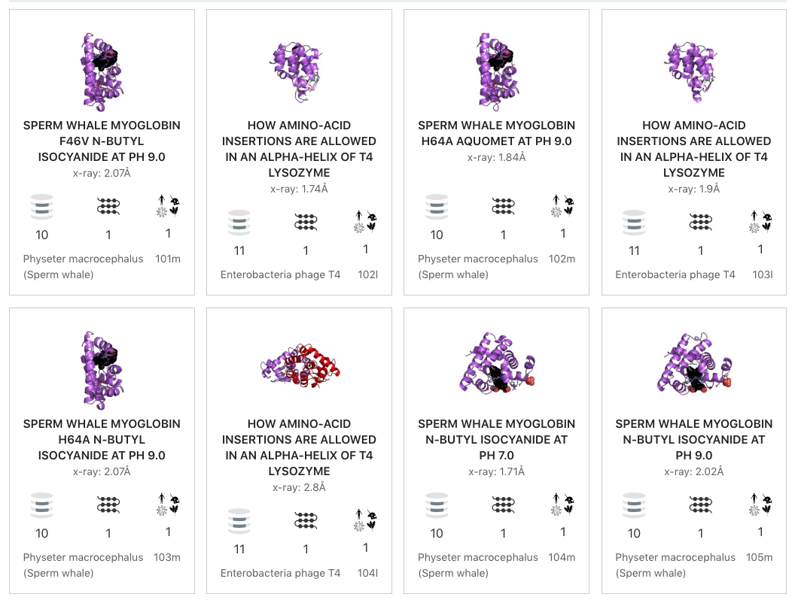
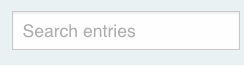
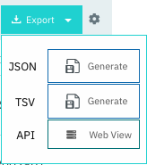

###########
Browse page
###########

********
Overview
********

The Browse page is composed a number of elements which interact to filter the
data in variety of different ways. The components on this page can be subdivided
into those which are always displayed and those which depend on the type of data
being viewed.

Browse page elements
====================

#. :ref:`Data_Display`
#. :ref:`Data_View`

    * :ref:`Tabular`
    * :ref:`Grid`
    * :ref:`Tree`

#. :ref:`Tabs`
#. :ref:`MemberDB_Filter`
#. :ref:`MemberDB_Selector`
#. :ref:`Text_Filter`
#. :ref:`Export_Button`
#. :ref:`Type_Filter`

    * :ref:`Entry_Filter`
    * :ref:`Protein_Filter`

.. _Data_Display:

************
Data Display
************

The data display is the main part of the browse page and shows the data selected
in the :ref:`Tabs`. The actual details shown will there also be dependent
on the selected type. These data can be displayed in a few different ways based
on the selected :ref:`Data_View`.

.. _Data_View:

Data Views
==========

There are usually a few different ways of viewing the data
selected in the :ref:`Tabs`. The bar above the data display shows a few icons,
not all of which are available for every data type.

.. image:: images/browse/data_view.png
  :alt: Data display icons

.. _Tabular:

Tabular view
------------

The tabular view is the default view and is available for all
:doc:`/data_types`.

.. image:: images/browse/tabular.png
  :alt: Tabular data icon

The table view icon formats data into a tabular view comprised of rows
representing individual entities. The table header describes the contents of
each column.

.. image:: images/browse/entry_data.png
  :alt: Entry table

.. _Grid:

Grid view
---------

The grid view is available for all :doc:`/data_types`.

.. image:: images/browse/grid.png
  :alt: Grid data icon

The Grid view displays a series of *cards* summarising details of the entities
being viewed.

.. image:: images/browse/entry_grid.png
  :alt: Entry grid

.. _Tree:

Tree view
---------

The tree view is currently only enabled for Taxonomy data. The tree view icon
is only shown where a tree view is possible.

.. image:: images/browse/tree.png
  :alt: Tree data icon

The taxonomy tree view component is reused in a number of different sections
of site. More details can be found at the :doc:`/taxonomy_viewer` documentation.

.. image:: images/browse/taxonomy_tree.png
  :alt: Taxonomy tree view

.. _Tabs:

**************
Data type tabs
**************

.. image:: images/browse/tabs.png
  :alt: Browse data type tabs

The data type tab is displayed immediately under the the :doc:`/banner`.
InterPro stores relationships between entries and a number of different
:doc:`/data_types` and this is reflected in tabs. The tabs are always visible in
the browse page and highlights the data type being displayed.

.. _MemberDB_Filter:

**********************
Member Database filter
**********************

.. image:: images/browse/memberdb_filter.png
  :alt: Member database filter

The Member Database filter acts together with the selected :ref:`Tabs` and the
type-specific filter

and displayed in the :ref:`Data_Display` to
be filtered so only matches to the selected database are displayed.

.. _MemberDB_Selector:

************************
Member Database selector
************************

The member database selector functions like the :ref:`MemberDB_Filter` to
display only items matching the selected database.

.. image:: images/browse/memberdb_selector.png
  :alt: Member database selector

.. _Text_Filter:

***********
Text filter
***********

The text filter is located next to the :ref:`Data_View` selector. The text
filter searches the data with the entered text to display items matching
the string.

.. _Export_Button:

*************
Export button
*************

The export button is located next to the :ref:`Data_View` selector. The export
button allows data from the :ref:`Data_View` to be downloaded as JSON or Tab
Separated Values (TSV). The data sent from the from the :doc:`api` to populate
the table can also be viewed using this component.

.. _Type_Filter:

*********************
Type-specific filters
*********************

The space directly under :ref:`Tabs` may contain a set of filters relevant to
the selected data type. These filters are only shown for certain types of data
described here.

.. _Entry_Filter:

Entry Filters
=============

.. _Protein_Filter:

Protein Filters
===============
