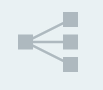
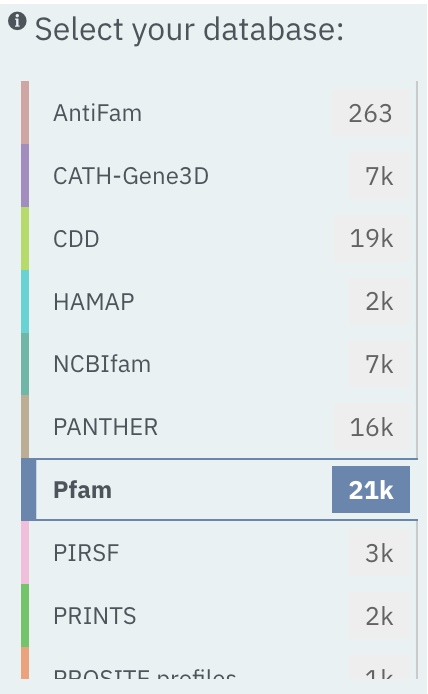
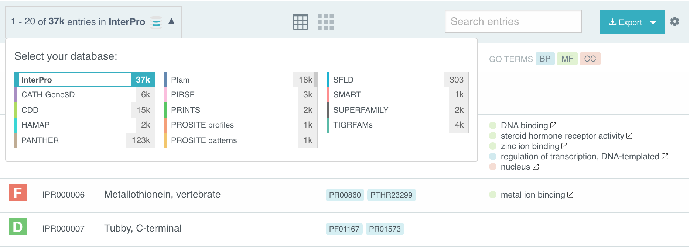

###########
Browse page
###########

********
Overview
********

The Browse page is composed a number of elements which interact to filter the
data in variety of different ways. The components on this page can be subdivided
into those which are always displayed and those which depend on the type of data
being viewed.

The two key components on this page are the :ref:`Tabs` which show the details
in the :ref:`Data_Display`.

Browse page elements
====================

#. :ref:`Data_Display`
#. :ref:`Data_View`

    * :ref:`Tabular`
    * :ref:`Grid`
    * :ref:`Tree`

#. :ref:`Tabs`
#. :ref:`MemberDB_Filter`
#. :ref:`MemberDB_Selector`
#. :ref:`Text_Filter`
#. :ref:`Export_Button`
#. :ref:`Type_Filter`

    * :ref:`Entry_Filter`
    * :ref:`Protein_Filter`
    * :ref:`Structure_Filter`

.. _Data_Display:

************
Data Display
************

The data display is the main part of the browse page and shows the data selected
in the :ref:`Tabs`. The actual details shown will there also be dependent
on the selected type. These data can be displayed in a few different ways based
on the selected :ref:`Data_View`.

.. _Data_View:

Data Views
==========

There are usually a few different ways of viewing the data
selected in the :ref:`Tabs`. The bar above the data display shows a few icons,
not all of which are available for every data type.

.. image:: images/browse/data_view.png
  :alt: Data display icons

.. _Tabular:

Tabular view
------------

The tabular view is the default view and is available for all
:doc:`/data_types`.

The table view icon formats data into a tabular view comprised of rows
representing individual entities. The table header describes the contents of
each column.

.. image:: images/browse/entry_data.png
  :alt: Entry table

.. image:: images/browse/protein_data.png
  :alt: Protein table

.. image:: images/browse/tax_data.png
  :alt: Taxonomy table

.. _Grid:

Grid view
---------

The grid view is available for all :doc:`/data_types`.

The Grid view displays a series of *cards* summarising details of the entities
being viewed.

.. image:: images/browse/entry_grid.png
  :alt: Entry grid

.. image:: images/browse/protein_grid.png
  :alt: Protein table

.. image:: images/browse/structure_grid.png
  :alt: Structure grid

.. _Tree:

Tree view
---------

The tree view is currently only enabled for Taxonomy data. The tree view icon
is only shown where a tree view is possible.

The taxonomy tree view component is reused in a number of different sections
of site. More details can be found at the :doc:`/taxonomy_viewer` documentation.

.. image:: images/browse/taxonomy_tree.png
  :alt: Taxonomy tree view

.. _Tabs:

**************
Data type tabs
**************

.. image:: images/browse/tabs.png
  :alt: Browse data type tabs

The data type tab is displayed immediately under the the :doc:`/banner`.
InterPro stores relationships between entries and a number of different
:doc:`/data_types` and this is reflected in tabs. The tabs are always visible in
the browse page and highlights the data type being displayed.

.. _MemberDB_Filter:

**********************
Member Database filter
**********************

The Member Database filter acts together with the selected :ref:`Tabs` and the
type-specific filter

and displayed in the :ref:`Data_Display` to
be filtered so only matches to the selected database are displayed.

.. _MemberDB_Selector:

************************
Member Database selector
************************

The member database selector functions like the :ref:`MemberDB_Filter` to
display only items matching the selected database.

.. _Text_Filter:

***********
Text filter
***********

The text filter is situated next to the :ref:`Data_View` selector. The text
filter searches the data with the entered text to display items matching
the string.

.. image:: images/browse/text_filter.png
  :alt: Text Filter

.. _Export_Button:

*************
Export button
*************

The export button is located next to the :ref:`Data_View` selector. The export
button allows data from the :ref:`Data_View` to be downloaded as JSON or Tab
Separated Values (TSV). The data sent from the from the :doc:`api` to populate
the table can also be viewed using this component.

.. image:: images/browse/export.png
  :alt: Export Button

.. _Type_Filter:

*********************
Type-specific filters
*********************

The space directly under :ref:`Tabs` may contain a set of filters relevant to
the selected data type. These filters are only shown for certain types of data
described here.

.. _Entry_Filter:

Entry Filters
=============

The Entry filters change depending on whether the selected database is InterPro
or one of the :doc:`member_databases`.

InterPro Entry Filters
----------------------

If the InterPro is the selected database, a set of three filters is displayed;
InterPro Type, Integrated Database and GO Terms.

.. image:: images/browse/interpro_entry_filter.png
  :alt: InterPro Entry Filters

* **InterPro Type**: Limits the data in the :ref:`Data_View` to the selected :doc:`entry_types`.
* **Integrated Database**: Limits the data displayed in the :ref:`Data_View` to entries which have an integrated signature from the selected member database.
* **Go Terms**: Filter by selected Go Terms from `InterPro2GO <https://www.ebi.ac.uk/GOA/InterPro2GO>`_.

Member database Entry Filters
-----------------------------

The filters displayed when a member database is selected in the :ref:/memberdb_filter
show some different filters.

.. image:: images/browse/memberdb_entry_filter.png
  :alt: MemberDB Entry Filters

* **Member database entry type**: Member database entry types may correspond to :doc:`/entry_types`.
* **InterPro state**: This filter can be used to view only those member databases entries which are integrated/not integrated into InterPro entries.

.. _Protein_Filter:

Protein Filters
===============

Just as with :ref:`Entry_Filter`, Protein filters change based on the selection
in the :ref:`MemberDB_Filter` component. The basic filters are displayed
irrespective of which selection is made and an extra filter when the
**All Proteins** option is selected.

Database selected
-----------------

If a database has been selected then the following three filters are displayed.

.. image:: images/browse/proteins_filter.png
  :alt: Protein Filters

* **UniProt Curation**: The `UniProtKB <https://www.uniprot.org/help/uniprotkb>`_ is split into two sections. The reviewed set are manually curated and the unreviewed set are derived from public databases automatically integrated into UniProt.
* **Taxonomy**: This filter allows the displayed list of proteins to be limited to certain organisms.
* **Sequence Status**: This filter allows proteins to be limited to complete proteins or fragments.

All Proteins
------------

The **Matching Entries** filter is only displayed when the All Proteins option is selected in the :ref:`MemberDB_Filter`.

.. image:: images/browse/all_proteins_filter.png
  :alt: All Protein Filter

* **Matching Entries**: This filter allows selection of proteins which do or do not contain matches to Entries in the InterPro dataset.

.. _Structure_Filter:

Structure Filters
=================

Structure filters do not vary depending on which option has been selected in the :ref:`MemberDB_Filter`.

.. image:: images/browse/structure_filter.png
  :alt: Structure Filter

* **Experiment Type**: This filter allows selection of structures based on the type of experimental data the structure is based on.
* **Resolution**: This filter allows structures to be selected based on the resolution of the structure.
