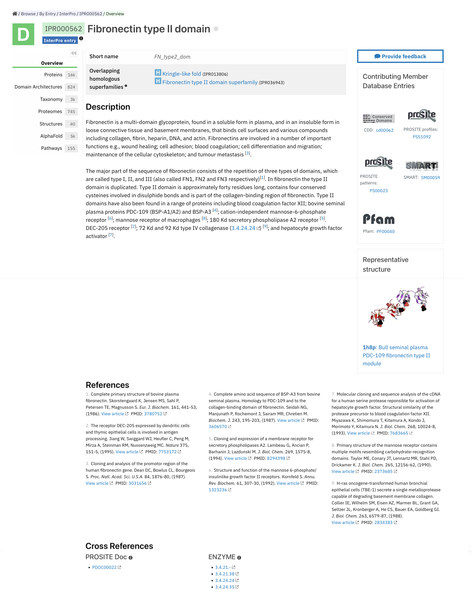
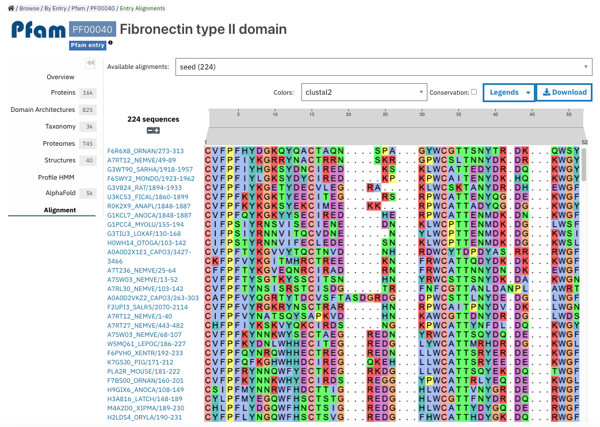
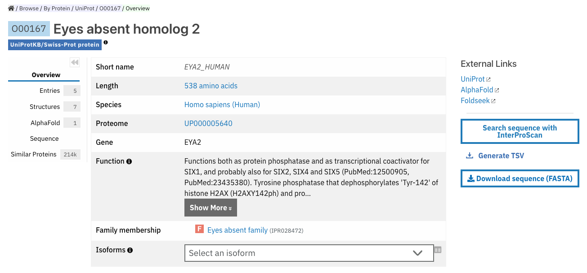
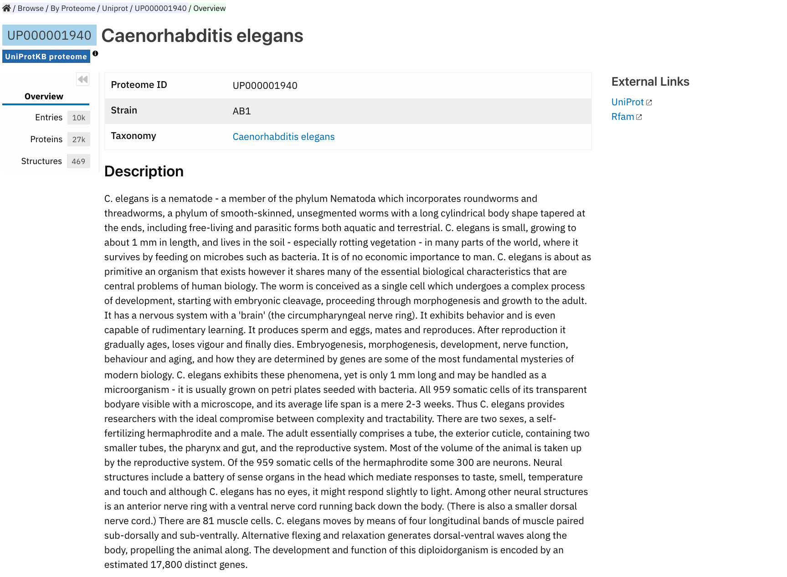
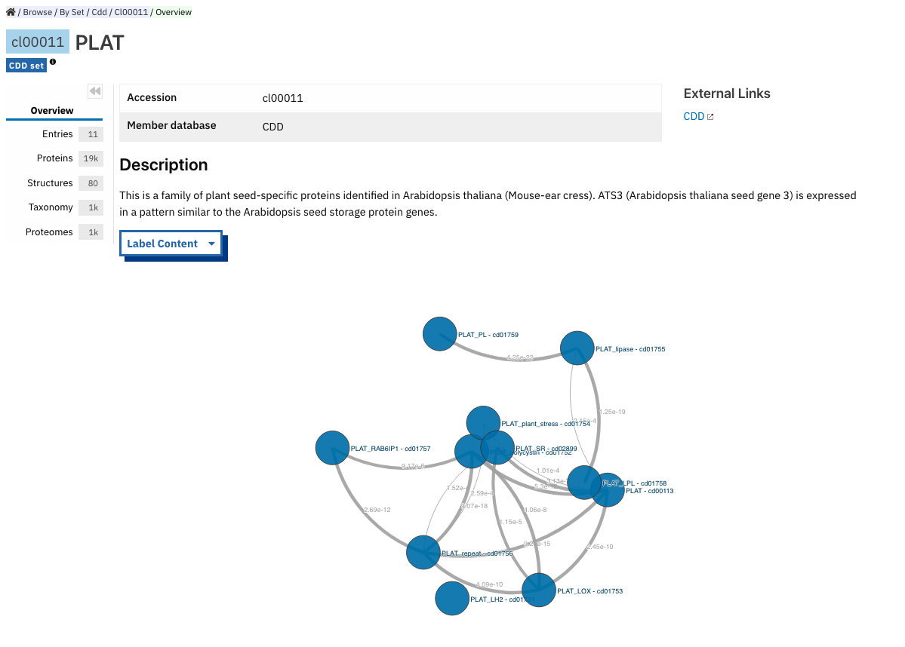

###########
Browsing entries in the InterPro website
###########

.. :ref:overlapping entries_info.html#overlapping
.. :ref:relationship entries_info.html#relationship
.. :ref:entry_types entries_info.html#entry-types
.. :ref:text_search searchways.html#text-search
.. :ref:quick_search searchways.html#quick-search

You can get to entry pages in InterPro in lots of different ways. Commonly this will involve clicking on 
a link to an entry from one of the :doc:`search methods </searchways>`.  This section describes the 
different types of entries and what you will find for each of their pages.

There are 7 categories of entry pages in InterPro:

- :ref:`InterPro entry <entry_page>`
- :ref:`Member database signature <memberdb_page>`
- :ref:`Protein <protein_page>`
- :ref:`Structure <structure_page>`
- :ref:`Taxonomy <taxonomy_page>`
- :ref:`Proteome <proteome_page>`
- :ref:`Set <set_page>`

The following entry data tabs are available when appropriate. We describe each in detail in the first 
entry page it appears in. Most entry data tabs will be described within the :ref:`entry_page`.

- :ref:`proteins` 
- :ref:`ida`
- :ref:`taxonomy` 
- :ref:`proteomes`
- :ref:`structures`
- :ref:`interactions`
- :ref:`pathways`
- :ref:`Genome3d`
- :ref:`signature`
- :ref:`alignment`
- :ref:`sets`
- :ref:`entries`
- :ref:`sequence`
- :ref:`similar_proteins`

.. _entry_page:

********************
InterPro entry page
********************

An InterPro entry represents a unique protein homologous superfamily, family, domain, repeat or important 
site based on one or more signatures provided by the :doc:`InterPro member databases </databases>`.

    InterPro entry page for IPR000562.

InterPro entry pages give a brief description of the entry, name and unique InterPro identifier. 
The InterPro entry type (homologous superfamily, family, domain, repeat or site) is also indicated by an 
icon (e.g. a D with a green background for a domain). Member databases contributing signatures to the 
entry are shown in a box on the right hand side of the page. :ref:`Overlapping homologous superfamilies 
<overlapping>` and/or :ref:`Relationships to other entries <relationship>` are indicated where available. 
Additional browse tabs provide further information on this entry, and are displayed when the information 
is available.

Types of data that may be available in the browse tabs of an InterPro entry page include:

.. _proteins:

Proteins
========
List of proteins that are included in this entry in a table.
Provides the option to display only proteins that have been manually curated in UniprotKB (**reviewed**), 
only proteins that have been automatically annotated (**unreviewed**), or all proteins (**both**, default).

.. _ida:

Domain architectures
====================
Provides information about the different domains arrangements for the proteins matching this entry based 
on Pfam signatures. For InterPro entries, information is provided regarding how the domain is present in 
protein sequences and what, if any, combinations arise with other entries.

.. _taxonomy:

Taxonomy 
========
List of species this entry is matching, based on data from `UniProt taxonomy 
<https://www.uniprot.org/help/taxonomy>`_. The first section displays the "**Key species**", these are 12 
model organisms commonly used in scientific research: *Oryza sativa subsp. japonica, Arabidopsis thaliana, 
Homo sapiens, Danio rerio, Mus musculus, Drosophila melanogaster, Caenorhabditis elegans, Saccharomyces 
cerevisiae, Schizosaccharomyces pombe, Escherichia coli, Escherichia virus T4, Halobacterium salinarum*.
The second section shows the list of species the proteins matching this entry are found in.

.. _proteomes:

Proteomes
=========
List of proteomes whose members are represented by proteins matching this entry.
A proteome represents a set of proteins whose genomes have been fully sequenced.
A given taxonomy node may have one or more proteomes, for example, to reflect different assemblies of a 
genome. Proteome data is imported from `UniProt proteomes <https://www.uniprot.org/help/proteome>`_. 

.. _structures:

Structures
==========
List of structures from the `PDBe <https://www.ebi.ac.uk/pdbe/>`_ database that match to protein sequences 
included in this entry.

.. _pathways:

Pathways
========
List of pathways identified for protein sequences included in this entry. This information is provided by 
the `MetaCyc Metabolic Pathway Database <https://metacyc.org/>`_ and the `Reactome database <https://reactome.org/>`_.

.. _interactions:

Interactions
============
List of proteins characterised in experimentally proven data in which the proteins matching an entry are 
involved in protein:protein interactions.

.. _genome3d:

Genome3D
========
Lists the structural models for this entry from the `Genome3D resource <http://www.genome3d.eu/>`_. More 
information about this data is available on the `train online course <https://www.ebi.ac.uk/training/online/course/genome3d-annotations-interpro>`_.

.. _memberdb_page:

********************
Member database page
********************
InterPro provides entry pages for each signature that a member database holds. This includes signatures 
that have not yet been, or can't be, integrated into InterPro (:ref:`unintegrated signatures <entry_types>`).
 
Member database signature entries provide information about which database the signature is from, the 
signature identifier, the type of entry as defined by the member database (e.g. family, domain or site), 
and the short name given to the entry by the member database. The right hand side of the page provides 
links to the InterPro entry in which this signature has been integrated, and an external link to the 
signature on the member database's website.

.. figure:: images/browse_pages/member_db_page.png
    :alt: Member database page

    InterPro member database page for Pfam signature PF00040.

In addition to the :ref:`proteins`, :ref:`taxonomy`, :ref:`proteomes` and :ref:`structures` tabs member database 
pages may also display information in the following additional tabs: :ref:`sets`, :ref:`signature` and :ref:`alignment`. 

.. _sets:

Sets
====
Some :doc:`InterPro member databases </member_databases>` create groups of families that are evolutionary 
related. Pfam calls them clans, CDD uses the term superfamily and, for PIRSF and Panther the concept is 
associated with the parent families of their hierarchy. We use the umbrella term Set to refer to all of 
them.
This tab is only available for entries whose member database has provided this classification. It displays 
the set to which the current entry belongs, clicking on the accession redirects to the :ref:`set_page`.

.. figure:: images/browse_pages/set_tab.png
    :alt: Member database set tab 

.. _signature:

Signature
==========
The signature representing the model that defines the entry is visualized in this page as a logo, 
using `Skylign <http://www.skylign.org/>`_. Currently, the logo data is only displayed for the Pfam 
member database, but we hope to integrate other member databases whose models can be represented in 
this way in the future.

The visualization displays the amino acid conservation for each residue in the model. To navigate large 
logos, the user can drag the rendered area to a desired position. Alternatively, the user can input a 
residue number to be viewed. When selecting a particular residue in the logo, the probabilities of each 
amino acid are displayed in the bottom part.

.. figure:: images/browse_pages/signature_tab.png
    :alt: Member database signature tab 

.. _alignment:

Alignment
==========
This section allows users to view and download any available alignment file that is associated with the 
current member database signature. Currently, the alignment files are only available for the Pfam member 
database, but hopefully we will be able to include alignments for other member databases in the future.

First, one of the available alignments has to be selected. For example in the image below the user has 
selected the "seed" alignment. If the selected alignment has more than 1000 sequences, a warning message 
appears to inform users that big alignments can cause memory issues in the browser. A compressed file 
(gzip) of the current alignment is available by clicking on the **Download** button.

Interacting with the grey navigation bar over the sequences allows users to navigate the alignment; 
dragging the left and right limits of the navigation bar allows users to zoom to a particular position 
or adjust the zoom level. Alternatively, the zoom level can also be defined by scrolling up/down while 
holding the [ctrl] key.
Scrolling up/down allows to move other sequences in the alignment into the visible area of the viewer.

.. _protein_page:

******************
Protein entry page
******************
The Protein entry page contains information on a specific protein provided by `UniProt <https://www.uniprot.org/>`_. 
Protein pages can be accessed either by entering a UniProt accession in a :ref:`text_search` or by clicking on a protein
accession from the :ref:`proteins` tab in an entry page.
 
The protein page provides the protein accession, the short name given to the protein by Uniprot, the length 
of the protein sequence, species in which the protein is found, the proteome it belongs to and a brief 
description of the protein's function where known. All the :ref:`InterPro family entries <entry_types>` 
this protein is matching are listed under "**Protein family membership**". An external link to the protein 
entry in `UniprotKB <https://www.uniprot.org/>`_ is provided on the right hand side of the page.

    Protein entry page for D3ZTE0.

The protein entry page also displays the :doc:`protein sequence viewer </protein_viewer>` to show the 
associated domains, sites etc.

This page includes up to four tabs: :ref:`entries`, :ref:`structures`, :ref:`sequence` 
and :ref:`similar_proteins`.

.. _entries:

Entries
=======
List of InterPro entries that include this entity. 

.. _sequence:

Sequence
========
This tab shows the protein FASTA sequence. The sequence can be used to perform two types of search, 
available on the right side of the screen: `InterProScan search 
<https://www.ebi.ac.uk/interpro/search/sequence/>`_ or 
`HMMER search <https://www.ebi.ac.uk/Tools/hmmer/search/phmmer>`_, which redirects to the corresponding 
pages.

.. _similar_proteins:

Similar proteins
================
List of proteins that have the same domain architecture as this protein, including the Pfam/InterPro accession 
for each domain.

.. _structure_page:

********************
Structure entry page
********************
InterPro provides entries for all the structures available in the `Protein Data Bank in Europe (PDBe) 
<https://www.ebi.ac.uk/pdbe/>`_. A structure search can be performed by clicking on a structure provided 
in a results list or by entering the protein structure identifier in the :ref:`quick_search` 
box (magnifying glass symbol) or by performing a :ref:`text_search`.
 
At the top of the structure page, general information about the structure is displayed: the structure's 
accession number (PDB ID), resolution, release date, the method used to determine the structure 
(e.g. "Xray") and the chains composing the structure. An external link to the structure entry in the 
PDBe database is provided on the right hand side of the page.

Following, the general information section, a 3D viewer shows an interactive view of the 3D structure. 
Below it, the :doc:`protein sequence viewer </protein_viewer>` has an extra category representing the secondary structure 
information. Hovering over one of the tracks highlights the corresponding region of the protein structure 
in the 3D structure viewer.

.. figure:: images/browse_pages/structure_page.png
    :alt: Structure entry page 

    Structure entry page for 1t2v.

More information is available on the corresponding `train online section 
<https://www.ebi.ac.uk/training/online/course/interpro-functional-and-structural-analysis-protein-sequences/text-search/searching-protein>`_.

The following tabs may be available: :ref:`entries` and :ref:`proteins`.

.. _taxonomy_page:

*******************
Taxonomy entry page
*******************
Taxonomy pages display the name, taxonomy ID, lineage and children nodes for a particular taxon. Any 
reference to this taxon from another page throughout the website will link to this page.

The overview also includes a graphical representation of the lineage of the selected taxon. The nodes 
in the visualization are also links, so you can jump to the page of a particular taxon of interest.

.. figure:: images/browse_pages/taxonomy_page.png
    :alt: Taxonomy entry page 

    Taxonomy entry page for *Caenorhabditis elegans*

The following tabs may be available: :ref:`entries`, :ref:`proteins`, :ref:`structures` 
and :ref:`proteomes`.

.. _proteome_page:

*******************
Proteome entry page
*******************
The proteome entry page displays general information provided by `UniProt <https://www.uniprot.org/>`_: its ID, strain, 
and a link to the related species. 

The following tabs may be available: :ref:`entries`, :ref:`proteins` and :ref:`structures`.

    Proteome entry page for UP000001940

The image shows the proteome page for *C. elegans*, whose proteome ID is UP000001940, and as you can see from the counters 
in the tabs has 9K related InterPro entries, 27K proteins and 363 structures. Notice this data is for InterPro version 
81.0, and it is used here just as an example.

.. _set_page:

**************
Set entry page
**************

Some InterPro member databases create groups of families that are evolutionarily related, called sets. This page offers 
an overview of a specific set provided by a member database, it includes a short description and an interactive view of 
the signatures included in the set.

    Set entry page for cl00011 (CDD)

The following tabs may be available: :ref:`entries`, :ref:`proteins`, :ref:`structures`, 
:ref:`taxonomy`, :ref:`proteomes` and :ref:`alignment_clan`.

.. _alignment_clan:

Alignments
==========

List of signatures included in the clan and their alignment with other signatures in the clan.

    Alignment tab for cl00011 (CDD)

