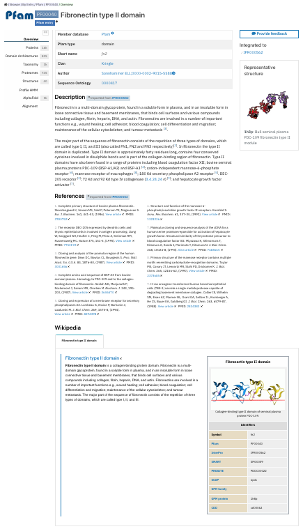
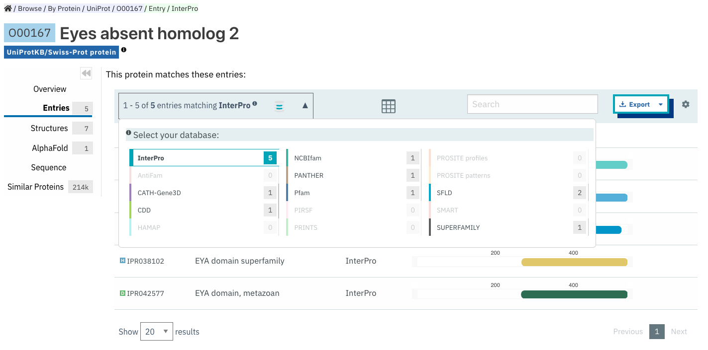
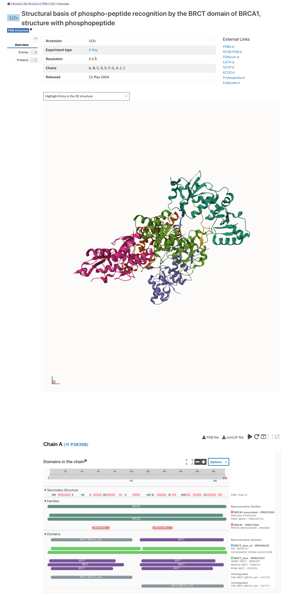
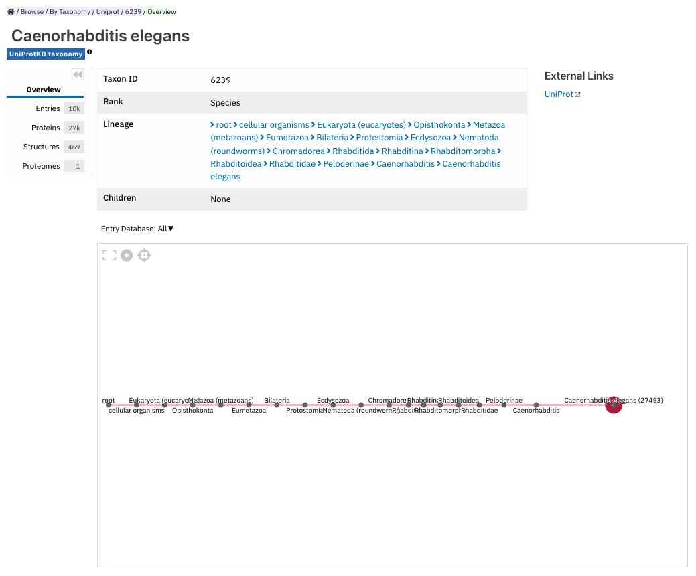

########################################
Browsing entries in the InterPro website
########################################

.. :ref:overlapping entries_info.html#overlapping
.. :ref:relationship entries_info.html#relationship
.. :ref:entry_types entries_info.html#entry-types
.. :ref:text_search searchways.html#text-search
.. :ref:quick_search searchways.html#quick-search

You can get to entry pages in InterPro in lots of different ways. Commonly this will involve clicking on 
a link to an entry from one of the :doc:`search methods </searchways>`.  This section describes the 
different types of entries and what you will find for each of their pages.

There are 7 categories of entry pages in InterPro:

- :ref:`InterPro entry <entry_page>`
- :ref:`Member database signature <memberdb_page>`
- :ref:`Protein <protein_page>`
- :ref:`Structure <structure_page>`
- :ref:`Taxonomy <taxonomy_page>`
- :ref:`Proteome <proteome_page>`
- :ref:`Set/Clan <set_page>`

The following entry data tabs are available when appropriate. We describe each in detail in the first 
entry page it appears in. Most entry data tabs will be described within the :ref:`entry_page`.

- :ref:`proteins` 
- :ref:`ida`
- :ref:`taxonomy` 
- :ref:`proteomes`
- :ref:`structures`
- :ref:`alphafold1`
- :ref:`interactions`
- :ref:`pathways`
- :ref:`signature`
- :ref:`subfamilies`
- :ref:`alignment`
- :ref:`curation`
- :ref:`entries`
- :ref:`sequence`
- :ref:`similar_proteins`

.. _entry_page:

*******************
InterPro entry page
*******************

An InterPro entry represents a unique protein homologous superfamily, family, domain, repeat or important 
site based on one or more signatures provided by the :doc:`InterPro member databases </databases>`.

.. figure:: images/browse_pages/interpro_entry_page.png
    :alt: InterPro entry page
    :width: 800px

    InterPro entry page for `IPR000562 <https://www.ebi.ac.uk/interpro/entry/InterPro/IPR000562/>`_.

InterPro entry pages give a brief description of the entry, name and unique InterPro identifier. 
The InterPro entry type (homologous superfamily, family, domain, repeat or site) is also indicated by an 
icon (e.g. a D with a green background for a domain). 

Clicking on the star symbol next to the entry name will save the entry as a Favourite. The full list of saved
entries is available in the :ref:`favourite` in the homepage. More information about the data provided in an 

On the right hand side, the **Add your annotation** button allows the user to suggest updates to the InterPro annotation and the page member 
databases contributing signatures to the entry are shown in a box. Below, the **Contributing Member Database Entry** or entries integrated into 
the InterPro entry are listed with links to the corresponding :ref:`member database pages <memberdb_page>`. At the bottom of this column, if 
any experimentally solved structure is available, a **Representative structure** shows a small static 3D representation, the corresponding PDB ID and name and a link to the 
:ref:`structure entry page <structure_page>`.

:ref:`Overlapping homologous superfamilies <overlapping>` and/or :ref:`Relationships to other entries <relationship>` are indicated where available. 

InterPro entry page can be found in the :doc:`InterPro Entries : essential information </entries_info>` section 
of the documentation. 

Additional tabs in the left-hand side menu provide further information about the entry, and are displayed when 
the data is available. Types of data that may be available in the menu of an InterPro entry page include: :ref:`proteins`, :ref:`ida`, 
:ref:`taxonomy`, :ref:`proteomes`, :ref:`structures`, :ref:`alphafold1`, :ref:`pathways` and :ref:`interactions`.

Althought most InterPro entries remain carefully reviewed by our curators, some type Family entries are AI-generated from PANTHER, NCBIfam or CATH-Gene3D 
signatures which cover approximately the whole protein length. For these entries, the name, short-name and description have been generated automatically 
using a Large Language Model. All AI-generated content is flagged as such with an |AI_tag| tag. Please consider this content has been subjected to curator
review when interpreting related results. More information on AI-generated content can be found in :doc:`AI-generated content </llm_descriptions>`.

    InterPro AI-generated entry page for `IPR051632 <https://www.ebi.ac.uk/interpro/entry/InterPro/IPR051632/>`_. 
    Name, short-name and description have been generated using a Large Language Model and are flaggged accordingly.

.. _proteins:

Proteins
========
List of proteins that are included in this entry displayed in a table.
There is an the option to display only proteins that have been manually curated in UniprotKB (**reviewed**), 
only proteins that have been automatically annotated (**unreviewed**), or all proteins (**both**, default).

For each protein, the table displays the UniProt ID, name, corresponding gene, the organism where it is found, 
a link to the protein :ref:`AlphaFold structure prediction page <alphafold1>` and a small protein viewer that 
highlights the region of the protein matched by the InterPro entry.

.. _ida:

Domain architectures
====================
Provides information about the different domains arrangements for the proteins matching this entry based 
on Pfam signatures. For InterPro entries, it provides information about where the domain is located in 
protein sequences and what, if any, combinations arise with other domains. Domain architectures can be downloaded
in JSON and TSV formats through the **Export** button.

.. _taxonomy:

Taxonomy 
========
List of species this entry is matching, based on data from `UniProt taxonomy 
<https://www.uniprot.org/help/taxonomy>`_. The information can be displayed in 4 different ways through the view options menu:

- Table with the list of all the species the proteins matching this entry are found in.
- Taxonomy tree of all the species the proteins matching this entry are found in.
- Sunburst view displays the taxonomy distribution of the proteins matching the entry, from the least specific at the centre to more specific going towards the outside.
- Table with the number of proteins found for key species, these are 12 model organisms commonly used in scientific research: *Oryza sativa subsp. japonica, Arabidopsis thaliana, Homo sapiens, Danio rerio, Mus musculus, Drosophila melanogaster, Caenorhabditis elegans, Saccharomyces cerevisiae, Schizosaccharomyces pombe, Escherichia coli, Escherichia virus T4, Halobacterium salinarum*.

Sunburst is the default view of the subpage. A range of options can be selected to customise the view:

- The segment size can be adjusted based on the number of sequences matching a taxon (default) or by the number of species per taxon.
- The sunburst depth can be adjusted between 2 to 8 rings.

        Taxonomy sunburst view for `PF00120 <https://www.ebi.ac.uk/interpro/entry/integrated/pfam/PF00120/taxonomy/uniprot/#sunburst>`_

In the table views, for each organism, the taxonomy identifier and protein count information are provided. The ACTIONS column offers the possibility to:

- View all the protein matches in the :ref:`proteins` tab
- Download a FASTA file of the protein matches
- View the taxonomy information in the :ref:`taxonomy_page`

If the first option is selected, a table with all the corresponding proteins is displayed. For each protein, we can see the UniProt ID, name, corresponding 
gene, the organism where it is found, a link to the protein :ref:`AlphaFold structure prediction page <alphafold1>` and a small protein viewer that highlights 
the region of the protein matched by the InterPro entry.

.. _proteomes:

Proteomes
=========
List of proteomes whose members are represented by proteins matching this entry.
A proteome represents a set of proteins whose genomes have been fully sequenced.
A given taxonomy node may have one or more proteomes, for example, to reflect different assemblies of a 
genome. Proteome data is imported from `UniProt proteomes <https://www.uniprot.org/help/proteome>`_. 
For each proteome, the same set of actions are available than the ones in :ref:`taxonomy`, the taxonomy 
information being replaced by proteome information in the :ref:`proteome_page`.

.. _structures:

Structures
==========
List of structures from the `PDBe <https://www.ebi.ac.uk/pdbe/>`_ database that match to protein sequences 
included in this entry.

.. _alphafold1:

AlphaFold
=========
AlphaFold protein structure predictions are generated by `DeepMind <https://deepmind.com/>`_ [:ref:`4 <ref_4>`]. 

At the top of the page a 3D viewer (powered by `Mol* <https://molstar.org/>`_) shows an interactive view 
of the predicted structure for one of the proteins matching the InterPro entry.
The structure is coloured by per-residue plDDT score, it can be zoomed in and out, and rotated. 
Clicking on a residue induces a zoom in effect and displays contacts with surrounding residues, clicking on the blank area 
around the structure zooms out.

The protein accession and organism are displayed on the left hand side, together with links to the corresponding 
`AlphaFold <https://alphafold.ebi.ac.uk/>`_ and `UniProt <https://www.uniprot.org>`_ websites. The model confidence
colour scale, determined using the plDDT score, is also displayed, varying from dark blue (very high confidence) to 
orange (very low confidence).

The data can be downloaded in PDB or mmCIF format, by clicking on the corresponding buttons below the 3D viewer.

.. figure:: images/browse_pages/alphafold_page.png
    :alt: AlphaFold page
    :width: 800px

    AlphaFold structure predictions tab for `IPR000562, UniProt O60449 <https://www.ebi.ac.uk/interpro/entry/InterPro/IPR000562/alphafold/?search=O60449#table>`_.

On an InterPro entry page, below the 3D viewer, a table containing the list of UniProt accessions matching the InterPro 
entry for which structure predictions have been generated is shown. For each protein it is possible to:

- Access the :ref:`protein_page` by clicking on the UniProt accession or name
- Access the :ref:`taxonomy_page` by clicking on the species
- Display the structure prediction on the current page by clicking on the **Show prediction** button

On a protein entry page, below the 3D viewer, the :doc:`protein sequence viewer </protein_viewer>` displays the member database 
signatures and InterPro entries matching the protein. Hovering over a match highlights the corresponding section in the 
predicted structure 3D view.

.. _pathways:

Pathways
========
List of pathways identified for protein sequences included in this entry. This information is provided by 
the `MetaCyc Metabolic Pathway Database <https://metacyc.org/>`_ and the `Reactome database <https://reactome.org/>`_.

.. _interactions:

Interactions
============
List of proteins characterised in experimentally proven data in which the proteins matching an entry are 
involved in protein:protein interactions.

.. _memberdb_page:

********************
Member database page
********************

InterPro provides entry pages for each signature that a member database holds. This includes signatures 
that have not yet been, or can't be, integrated into InterPro (:ref:`unintegrated signatures <entry_types>`).

    InterPro member database page for NCBIfam signature `NF012196 <https://www.ebi.ac.uk/interpro/entry/integrated/ncbifam/NF012196/>`_.

Member database signature entries provide information about which database the signature is from, the 
signature identifier, the type of entry as defined by the member database (e.g. family, domain or site), 
and the short name given to the entry by the member database. 

Some member databases provide a description giving information about the family/domain or site function, 
when this is not the case and the signature is integrated in an InterPro entry, the InterPro description is
displayed.

    InterPro member database page for CATH-Gene3D signature `G3DSA:1.10.10.10 <https://www.ebi.ac.uk/interpro/entry/cathgene3d/G3DSA:1.10.10.10/>`_.

To address the absence of annotations for certain member database signatures that are not integrated 
into any InterPro entry, we've employed AI to automatically generate descriptions by extracting information 
from Swiss-Prot. It's important to note that these descriptions have not undergone curator review, and we 
advise regarding them as preliminary sources of information. 
:doc:`Read more on AI-generated descriptions. </llm_descriptions>`

    InterPro member database page for PANTHER signature `PTHR13944 <https://www.ebi.ac.uk/interpro/entry/panther/PTHR13944/>`_. 
    AI-generated content is accordingly flagged with an |AI_tag| tag.

Some member databases create groups of families that are evolutionary related. Pfam calls them clans, 
CDD uses the term superfamily and, for PIRSF and Panther the concept is associated with the parent families of 
their hierarchy. We use the umbrella term Clan to refer to Pfam groups and Set to refer to the other groups. When available, the set/clan to which the signature 
belongs to is indicated.

The right hand side of the page provides links to the InterPro entry in which this signature has been integrated, and an external link to the signature 
on the member database's website when available. At the bottom of this column, if any experimentally solved structure is available, a **Representative 
structure** shows a small static 3D representation, the corresponding PDB ID and name and a link to the :ref:`structure entry page <structure_page>`. 
For Pfam signatures, the **Add your annotation** button allows the user to suggest updates to the Pfam annotation.

For signatures provided by the Pfam member database, a short extract of the wikipedia page is also displayed
when available to complete the description.

    InterPro member database page for Pfam signature `PF00040 <https://www.ebi.ac.uk/interpro/entry/pfam/PF00040/>`_.

In addition to the :ref:`proteins`, :ref:`taxonomy`, :ref:`proteomes` and :ref:`structures` tabs, member database 
pages may also display information in the following additional tabs: :ref:`ida`, :ref:`alphafold1`, :ref:`signature`, :ref:`alignment` 
and :ref:`curation`. 

.. _signature:

Signature
=========
The signature representing the model that defines the entry is visualised in this page as a logo, 
using `Skylign <http://www.skylign.org/>`_. The logo data is displayed for the NCBIfam, Pfam, PANTHER, 
PIRSF, and SFLD member databases.

The visualisation displays the amino acid conservation for each residue in the model. To navigate large 
logos, the user can drag the rendered area to a desired position. Alternatively, the user can input a 
residue number to be viewed. When selecting a particular residue in the logo, the probabilities of each 
amino acid are displayed in the bottom part.

.. figure:: images/browse_pages/signature_tab.png
    :alt: Member database signature tab 
    :width: 800px

.. _alignment:

Alignment
=========
This section allows users to view and download any available alignment file that is associated with the 
current member database signature. Currently, the alignment files are only available for the Pfam member 
database, but hopefully we will be able to include alignments for other member databases in the future.

First, one of the available alignments has to be selected. For example in the image below the user has 
selected the "seed" alignment. If the selected alignment has more than 1000 sequences, a warning message 
appears to inform users that big alignments can cause memory issues in the browser. A compressed file 
(gzip) of the current alignment is available by clicking on the **Download** button.

Interacting with the grey navigation bar over the sequences allows users to navigate the alignment; 
dragging the left and right limits of the navigation bar allows users to zoom to a particular position 
or adjust the zoom level. Alternatively, the zoom level can also be defined by scrolling up/down while 
holding the [ctrl] key.
Scrolling up/down allows to move other sequences in the alignment into the visible area of the viewer.

.. figure:: images/browse_pages/alignment_tab.png
    :alt: Member database alignment tab 
    :width: 800px

.. _curation:

Curation
========
This section provides information about the curation of the signature. Currently, it is only available for the Pfam member database. 
It is divided into 2 subsections:

- **Curation**: details about Pfam curators and Sequence ontology
- **HMM information**: displays the HMM building command used and offers the possibility to download the HMM profile defining the signature

.. figure:: images/browse_pages/curation.png
    :alt: Member database curation tab 
    :width: 800px

.. _subfamilies:

Subfamilies
===========
This section provides a list of subfamilies derived from the signature and a link to get more information in the member database website. 
Currently, this list is available for the PANTHER and CATH-Gene3D member databases. For PANTHER subfamilies, the GO terms associated to them 
are also displayed.

.. _protein_page:

******************
Protein entry page
******************
The Protein entry page contains information on a specific protein provided by `UniProt <https://www.uniprot.org/>`_. 
Protein pages can be accessed either by entering a UniProt accession or identifier in a :ref:`text_search` or by clicking on a protein
accession from the :ref:`proteins` tab in an entry page.
 
The protein page provides the protein accession, the short name (identifier) given to the protein by Uniprot, the length 
of the protein sequence, species in which the protein is found, the proteome it belongs to, the gene encoding for the protein and a brief 
description of the protein's function where known. All the :ref:`InterPro family entries <entry_types>` 
this protein is matching are listed under "**Protein family membership**". An external link to the protein 
entry in `Uniprot <https://www.uniprot.org/>`_, as well as the export of the matches in TSV format and the possibility 
to perform a `HMMER search <https://www.ebi.ac.uk/Tools/hmmer/search/phmmer>`_ or an `InterProScan search <https://www.ebi.ac.uk/interpro/search/sequence/>`_
are provided on the right hand side of the page.

.. figure:: images/browse_pages/protein_entry_page.png
    :alt: Protein entry page 
    :width: 800px

    Protein entry page for `O00167 <https://www.ebi.ac.uk/interpro/protein/UniProt/O00167/>`_.

The protein entry page also displays the :doc:`protein sequence viewer </protein_viewer>` to show the 
associated domains, sites etc.

When available, different isoforms of the protein can be selected to compare their InterPro matches 
with the consensus protein sequence. When an isoform is selected, a new :doc:`protein sequence viewer </protein_viewer>` 
corresponding to the selection is displayed and the url is update to reflect the change.
The isoform matches can also be viewed side by side with the consensus protein sequence by clicking on the split 
icon |split| after selecting an isoform.

When available, GO terms associated to InterPro entries and PANTHER families are displayed at the bottom of the page. 
GO terms provide information about Biological processes, Molecular function and Cellular components.

.. |split| image:: images/browse_pages/split_icon.png
  :alt: Split icon
  :width: 15pt

The following tabs may be available: :ref:`entries`, :ref:`structures`, :ref:`sequence`, :ref:`similar_proteins` 
and :ref:`alphafold1`.

.. _entries:

Entries
=======
List of InterPro entries that include this entity. The results can be filtered by member databases 
using the dropdown box located on the left side of the header of the result table. 
This functionality is available for all the tables presenting InterPro entries in the website.

.. _sequence:

Sequence
========
This tab shows the protein FASTA sequence. The full sequence or part of the sequence (by selecting the region 
of interest) can be used to perform two types of search, available on the right side of the screen: 
`InterProScan search <https://www.ebi.ac.uk/interpro/search/sequence/>`_ or 
`HMMER search <https://www.ebi.ac.uk/Tools/hmmer/search/phmmer>`_, which redirects to the corresponding 
pages.

.. _similar_proteins:

Similar proteins
================
List of proteins that have the same domain architecture as this protein, including the Pfam/InterPro accession 
for each domain.
The list can be filtered to either show all the protein matches or only the reviewed proteins from 
`UniProt <https://www.uniprot.org/>`_. For each protein the UniProt ID, name, length, corresponding gene, the 
organism where it is found and a link to the protein :ref:`AlphaFold structure prediction page <alphafold1>`.

.. _structure_page:

********************
Structure entry page
********************
InterPro provides entries for all the structures available in the `Protein Data Bank in Europe (PDBe) 
<https://www.ebi.ac.uk/pdbe/>`_. A structure search can be performed by clicking on a structure provided 
in a results list or by entering the protein structure identifier in the :ref:`quick_search` 
box (magnifying glass symbol) or by performing a :ref:`text_search`.
 
At the top of the structure page, general information about the structure is displayed: the structure's 
accession number (PDB ID), resolution, release date, the method used to determine the structure 
(e.g. "Xray") and the chains composing the structure. External links to  `PDBe <https://www.ebi.ac.uk/pdbe/>`_, 
`RCSB PDB <https://www.rcsb.org/>`_, `PDBsum <http://www.ebi.ac.uk/thornton-srv/databases/pdbsum/>`_, `CATH <https://cath-org.co.uk/>`_, 
`SCOP <https://scop.mrc-lmb.cam.ac.uk/>`_, `ECOD <http://prodata.swmed.edu/ecod/>`_ and 
`Proteopedia <https://proteopedia.org/wiki/index.php/Main_Page>`_ are provided on the right hand side of the page.

Following, the general information section, a 3D viewer (powered by `Mol* <https://molstar.org/>`_) shows an interactive view 
of the 3D structure. Hovering over a residue displays the name of the entry, the chain and residue information below the viewer. 
Clicking on a residue in the viewer induces a zoom in effect and displays contacts with surrounding residues, 
clicking on the blank area around the structure zooms out.
Below it, the :doc:`protein sequence viewer </protein_viewer>` with the InterPro matches is displayed for each chain. It has an extra category representing the secondary structure 
information. Hovering over one of the tracks highlights the corresponding region of the protein structure 
in the 3D structure viewer.

    Structure entry page for `1t2v <https://www.ebi.ac.uk/interpro/structure/PDB/1t2v/>`_.

More information is available on the corresponding `train online section 
<https://www.ebi.ac.uk/training/online/course/interpro-functional-and-structural-analysis-protein-sequences/text-search/searching-protein>`_.

The following tabs may be available: :ref:`entries` and :ref:`proteins`.

.. _taxonomy_page:

*******************
Taxonomy entry page
*******************
Taxonomy pages display the name, taxonomy ID, lineage and children nodes for a particular taxon. Any 
reference to this taxon from another page throughout the website will link to this page.

The overview also includes a graphical representation of the lineage of the selected taxon. The nodes 
in the visualisation are also links, so you can jump to the page of a particular taxon of interest.

    Taxonomy entry page for `Caenorhabditis elegans <https://www.ebi.ac.uk/interpro/taxonomy/uniprot/6239/>`_.

The following tabs may be available: :ref:`entries`, :ref:`proteins`, :ref:`structures` 
and :ref:`proteomes`.

.. _proteome_page:

*******************
Proteome entry page
*******************
The proteome entry page displays general information provided by `UniProt <https://www.uniprot.org/>`_: its ID, strain, 
and a link to the related species. 

The following tabs may be available: :ref:`entries`, :ref:`proteins` and :ref:`structures`.

.. figure:: images/browse_pages/proteome_page.png
    :alt: Proteome entry page 
    :width: 800px

    Proteome entry page for `UP000001940 <https://www.ebi.ac.uk/interpro/proteome/uniprot/UP000001940/>`_.

The image shows the proteome page for *C. elegans*, whose proteome ID is UP000001940, and as you can see from the counters 
in the tabs, has 10K related InterPro entries, 27K proteins and 469 structures. Links to the 
corresponding proteome pages in UniProt and Rfam can be found at the right hand side and a description of the organism 
(provided by UniProt) is displayed below. Notice this data is for InterPro version 99.0, and it is used here just as an example.

When selecting the tab **Entries**, a list of the InterPro entries matching any sequence in the proteome is displayed. The list 
of entries of any of the member databases is shown instead by selecting the database (provided it contains any instance) in the 
dropdown list that appears after clicking the box on top of the list.

.. _set_page:

*******************
Set/Clan entry page
*******************

Some :doc:`InterPro member databases </databases>` create groups of families that are evolutionary 
related, called sets/clans. This page offers an overview of a specific set/clan provided by a member database, 
it includes a short description and an interactive view of the signatures included in the set/clan. 
For the interactive view, different label types can be chosen through the **Label Content** menu: 
Accession, Name and Short name. For clans provided by the Pfam member database, an additional section 
provides literature references, when available.

.. figure:: images/browse_pages/set_page.png
    :alt: Set entry page 
    :width: 800px

    Set entry page for `cl00011 <https://www.ebi.ac.uk/interpro/set/all/cl00011/>`_ (CDD)

The following tabs may be available: :ref:`set_entries`, :ref:`proteins`, :ref:`structures`, 
:ref:`taxonomy`, :ref:`proteomes` and :ref:`alignment_clan`.

.. _set_entries:

Entries
=======
Provides the list of signatures included in the set/clan (accession, name and short name).

For Pfam clans, the Entries tab contains the list of Pfam entries included in the clan
and links to the entries SEED alignment and domain architectures pages.

