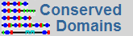
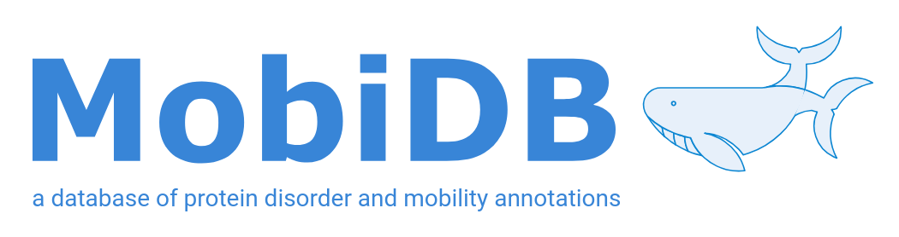
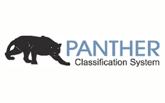
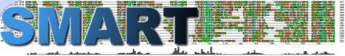
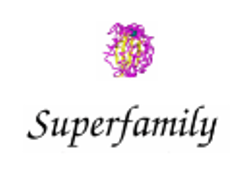
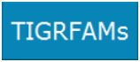

################################
InterPro consortium member databases
################################

InterPro is the world's most comprehensive resource for protein family and domain information, 
but InterPro is only possible due to the amazing classification work of our collaborators. 
InterPro integrates protein signatures from 13 member databases, which use a variety of different 
methods to classify proteins. Each of the databases has a particular focus (e.g. protein domains 
defined from structure, or full length protein families with shared function). We strive to integrate 
the signatures from the member databases into InterPro entries to identify where different member 
database entries are the same entity.

****
CATH-Gene3D
****

|cath| `<https://www.cathdb.info/>`_

The CATH-Gene3D database describes protein families and domain architectures in complete genomes. 
Protein families are formed using a Markov clustering algorithm, followed by multi-linkage clustering 
according to sequence identity. Mapping of predicted structure and sequence domains is undertaken using 
hidden Markov models libraries representing CATH and Pfam domains. CATH-Gene3D is based at University College, London, UK. 

****
CDD 
****
|cdd| `<https://www.ncbi.nlm.nih.gov/cdd>`_

CDD is a protein annotation resource that consists of a collection of annotated multiple sequence 
alignment models for ancient domains and full-length proteins. These are available as position-specific 
score matrices (PSSMs) for fast identification of conserved domains in protein sequences via RPS-BLAST. 
CDD content includes NCBI-curated domain models, which use 3D-structure information to explicitly define 
domain boundaries and provide insights into sequence/structure/function relationships, as well as domain 
models imported from a number of external source databases.

**** 
HAMAP
****

|hamap| `<https://hamap.expasy.org/>`_

HAMAP stands for High-quality Automated and Manual Annotation of Proteins. HAMAP profiles are manually 
created by expert curators. They identify proteins that are part of well-conserved protein families or 
subfamilies. HAMAP is based at the SIB Swiss Institute of Bioinformatics, Geneva, Switzerland.

****
MobiDB Lite 
****

|mobidb| `<http://old.protein.bio.unipd.it/mobidblite/>`_

MobiDB offers a centralized resource for annotations of intrinsic protein disorder. The database features 
three levels of annotation: manually curated, indirect and predicted. The different sources present a clear 
tradeoff between quality and coverage. By combining them all into a consensus annotation, MobiDB aims at 
giving the best possible picture of the “disorder landscape” of a given protein of interest. 

****
PANTHER
****

|panther| `<http://www.pantherdb.org/>`_

PANTHER is a large collection of protein families that have been subdivided into functionally related subfamilies, 
using human expertise. These subfamilies model the divergence of specific functions within protein families, 
allowing more accurate association with function, as well as inference of amino acids important for functional 
specificity. Hidden Markov models (HMMs) are built for each family and subfamily for classifying additional 
protein sequences. PANTHER is based at University of Southern California, CA, US.

****
Pfam
****

|pfam| `<https://pfam.xfam.org/>`_

Pfam is a large collection of multiple sequence alignments and hidden Markov models covering many common protein 
domains. Pfam is based at EMBL-EBI, Hinxton, UK.

****
PIRSF
****

|pirsf| `<https://proteininformationresource.org/pirsf/>`_

PIRSF protein classification system is a network with multiple levels of sequence diversity from superfamilies 
to subfamilies that reflects the evolutionary relationship of full-length proteins and domains. PIRSF is based 
at the Protein Information Resource, Georgetown University Medical Centre, Washington DC, US.

****
PRINTS
****

|prints| `<http://130.88.97.239/PRINTS/index.php>`_

PRINTS is a compendium of protein fingerprints. A fingerprint is a group of conserved motifs used to characterise 
a protein family or domain. PRINTS is based at the University of Manchester, UK.

****
PROSITE profiles
****

|prosite| `<https://prosite.expasy.org/>`_

PROSITE is a database of protein families and domains. It consists of biologically significant sites, patterns 
and profiles that help to reliably identify to which known protein family a new sequence belongs. PROSITE is 
based at the Swiss Institute of Bioinformatics (SIB), Geneva, Switzerland.

****
SFLD
****

|sfld| `<http://sfld.rbvi.ucsf.edu/archive/django/index.html>`_

SFLD (Structure-Function Linkage Database) is a hierarchical classification of enzymes that relates specific 
sequence-structure features to specific chemical capabilities.

****
SMART
****

|smart| `<http://smart.embl-heidelberg.de/>`_

SMART (a Simple Modular Architecture Research Tool) allows the identification and annotation of genetically 
mobile domains and the analysis of domain architectures. SMART is based at EMBL, Heidelberg, Germany.

****
SUPERFAMILY
****

|superfamily| `<https://supfam.mrc-lmb.cam.ac.uk/>`_

SUPERFAMILY is a library of profile hidden Markov models that represent all proteins of known structure. 
The library is based on the SCOP classification of proteins: each model corresponds to a SCOP domain and 
aims to represent the entire SCOP superfamily that the domain belongs to. SUPERFAMILY is based at the University of Bristol, UK.

****
TIGRFAMs
****

|tigrfam| `<http://tigrfams.jcvi.org/cgi-bin/index.cgi>`_

TIGRFAMs is a collection of protein families, featuring curated multiple sequence alignments, hidden 
Markov models (HMMs) and annotation, which provides a tool for identifying functionally related proteins 
based on sequence homology. TIGRFAMs was formerly based at the J. Craig Venter Institute, Rockville, MD, 
US and is now hosted by the NCBI.

