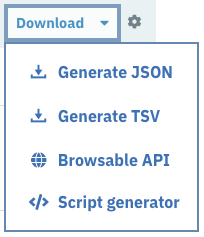
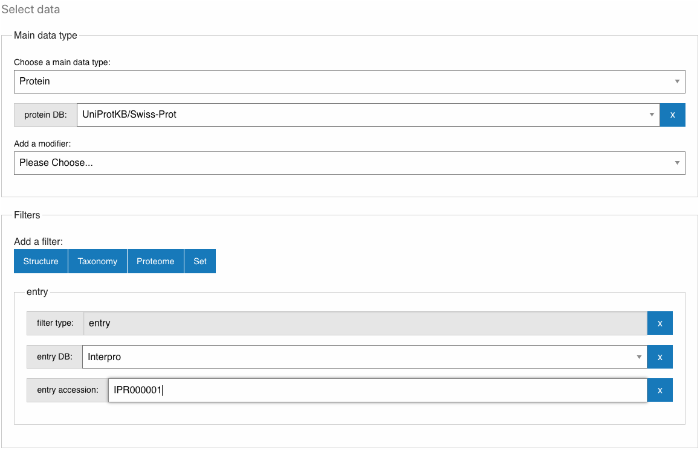

##############################
How to download InterPro data?
##############################

.. :ref:navigation_menu banner.html#navigation-menu
.. :ref:text_filter searchways.html#text-filter

InterPro data and search tools are freely available for download. We provide bulk downloads, 
data exports on each relevant InterPro page and an API to allow easy access for user scripts.

.. _bulk_download:

*************
Download page
*************
This is available under the `Download <https://www.ebi.ac.uk/interpro/download/>`_ section 
in the :ref:`navigation menu <navigation_menu>`. This page is divided into multiple tabs.

- The **InterPro** tab provides various files containing pre-calculated InterPro data for the current release that can be downloaded. Data from previous releases are available in the `InterPro ftp <https://ftp.ebi.ac.uk/pub/databases/interpro/>`_. 
- The **InterProScan** tab provides a downloadable version of the :doc:`InterProScan software </interproscan>`.
- The **Pfam** tab gives access various Pfam files. Data from previous Pfam releases are available in the `Pfam ftp <https://ftp.ebi.ac.uk/pub/databases/Pfam/>`_.
- The **PRINTS** and **SFLD** tabs give access to the latest PRINTS and SFLD release files, available from the InterPro ftp.
- The **AntiFam** tab give access to the latest AntiFam release files. 

*************
Export button
*************

The export button, found on various entry pages in InterPro, is located next to the 
:ref:`text filter <text_filter>` at the top of result tables. It allows data to be 
downloaded as JSON or Tab Separated Values (TSV). The data sent from the :ref:`api` to 
populate the table can also be viewed using this component.
When the file to generate is too big (bigger than 10K entities) we recommend to use 
the `Script generator <https://www.ebi.ac.uk/interpro/result/download/#/entry/InterPro/|accession>`_ 
described in the section below to get the information from the API.

|

.. _your_downloads:

**************
Your downloads
**************

This page is accessible through the **Results** tab in the :ref:`navigation menu <navigation_menu>`, 
under "**Your downloads**" section.

The purpose of this page is to give the user a way to select and filter InterPro data. 
Filtered data can then be downloaded in different file formats (if the selection has 
less than 10K entities), using the provided API call or through a script generated 
automatically. 

For Example, the image above shows **Protein** as the main data type selected and it will 
only select proteins included in the database **UniProtKB/Swiss-Prot**; this selection is 
then filtered by the selection of the endpoint **entry** with **InterPro** as the database 
and accession **IPR000001**. In other words this will generate the list of SwissProt 
proteins that are matching IPR000001 (also available under the Proteins tab in the InterPro 
entry page for `IPR000001 <https://www.ebi.ac.uk/interpro/entry/InterPro/IPR000001/protein/reviewed/#table>`_, 
with the reviewed option selected).
The results are stored in the browser (IndexedDB), allowing to retrieve previous searches.

Output formats
==============
The following output formats are currently supported, if the number of entities selected 
is lower than 10K: 

- **Text**: a list of accessions, 1 per line
- **FASTA**: a single file with multiple sequences in Fasta format (only available for proteins)
- **JSON**: it reuses the format returned by the InterPro API.
- **TSV**: reformats the JSON from the API to create a TSV file.
After selecting the output format, clicking on the **Download** button at the bottom of the 
page will start the downloading.

Programming scripts
===================
The script can be generated in 4 different languages: Python 3, Perl and JavaScript, 
it allows the download of the filtered data directly from the :ref:`InterPro API <api>` 
and can be integrated in the users own program.

.. _api:

************************************************
InterPro Application Programming Interface (API)
************************************************
The InterPro API provides programmatic access to all the InterPro entries and their related 
entities in Json format.The API has six main endpoints, which corresponds to the 
:doc:`InterPro data types </browse>`: entry, protein, structure, taxonomy, proteome and 
set.

An API call is formed of one or multiple endpoint blocks. An endpoint block consists of a 
data type, a source database and an accession (e.g. api/datatype/sourcedb/accession).

For example the URL **/entry/interpro** provides a pageable list of all the InterPro 
entries. And the URL **/protein/uniprot/p99999** returns all the details of the protein 
identified with the UniProt accession P99999.

The combined URL **/entry/interpro/protein/uniprot/p99999** returns the list of all the 
InterPro entries that match in the P99999 protein accession.

For more information on how to use the InterPro API, you can watch `this recorded webinar 
<https://www.ebi.ac.uk/training/online/course/accessing-interpro-programmatically>`_
or have a look at the API documentation on our |github| `GitHub repository <https://github.com/ProteinsWebTeam/interpro7-api/tree/master/docs>`_.

.. |github| image:: images/icons/github.svg
  :alt: Github icon
  :width: 15pt