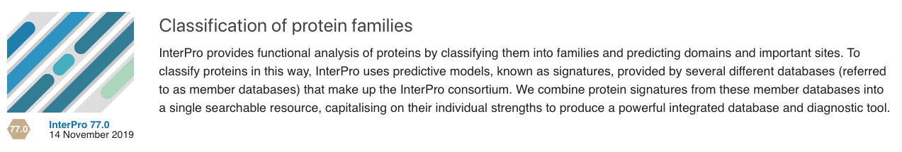
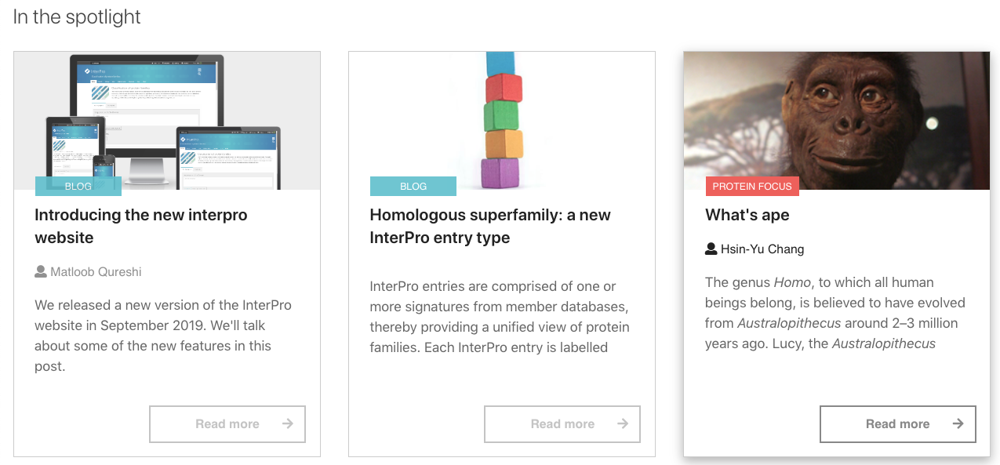
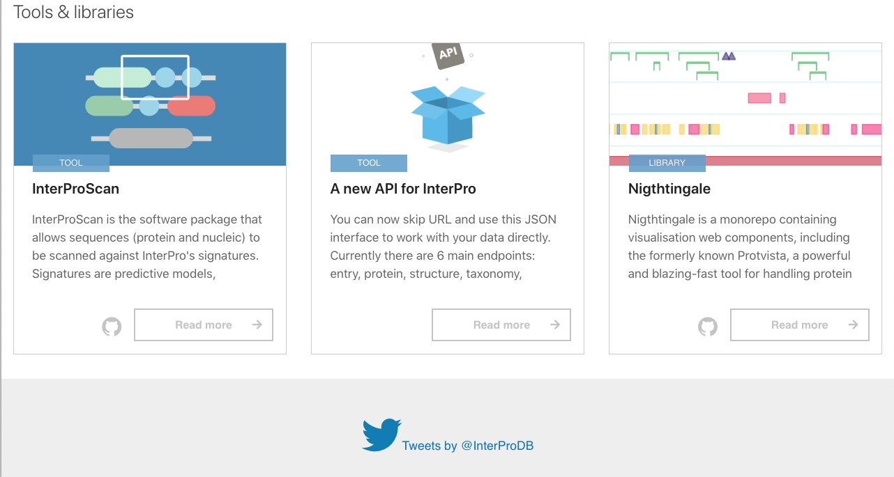

########
Homepage
########

The contents of the InterPro homepage underneath the :doc:`/banner` can be split
into in the following sections:

#. :ref:`Summary`
#. :ref:`Search`
#. :ref:`Data`
#. :ref:`News`

.. _Summary:

****************
InterPro
****************

This section gives an overview of the InterPro resource. The release version and
date is displayed under the graphic.

.. _Search:

******
Search
******

The search section shows a multifunctional search component. The tabs above the
text entry area allows the selection of one of the three types of search supported by
InterPro. More details about searching are available on the :doc:`/searchpage`.

.. image:: images/homepage/homepage_search.png
  :alt: Homepage search component

.. _Data:

****
Data
****

The Data section is comprised of two components, the left component shows an
overview of InterPro data and shortcuts to different views of our data. The
component on the right shows the latest entries.

Member database component
=========================

This component shows icons for the :doc:`/member_databases`. The text under each
icon provides information about the version of the member database and an estimate of the number of
Entries from that resource in the current InterPro release. Each of
the member database icons link to the :doc:`/browse` showing data
filtered to match the selected Member Database.

.. image:: images/homepage/homepage_member_database.png
  :alt: Homepage member database component

Entry type component
====================

This component shows icons for :doc:`/entry_types`. An estimate of the number
of entries corresponding to each type is shown under each icon. Clicking on an
icon will display the :doc:`/browse` showing InterPro data filtered by the
selected Entry type.

.. image:: images/homepage/homepage_entry_type.png
  :alt: Homepage entry type component

Species component
=================

The Species component shows a set of icons corresponding to several key
Species. An estimate of the number of Entries and Proteins associated with
each species is shown below the icon. Clicking on an icon will display the
the associated :doc:`/taxonomy` for the selected organism. Clicking on the
text below the icon will display the entry or protein table of the
:doc:`/taxonomy`.

.. image:: images/homepage/homepage_species.png
  :alt: Homepage species component

Latest Entries component
========================

The Latest Entries component shows a list of the latest entries. Each row in the
component shows the entry type icon, followed by the name and accession of the
Entry. The clickable icons beneath the text show the number of proteins,
domain architectures, taxa, structures and member database which match to the
Entry. Each of the icons is clickable and provides a shortcut to the
corresponding section of the :doc:`/entry`.

.. image:: images/homepage/homepage_latest_entries.png
  :alt: Homepage latest entries component

.. _News:

********************
News and information
********************

The final section of the homepage comprises components linking to the
articles from the
`InterPro Blog <https://proteinswebteam.github.io/interpro-blog/>`_,
technical aspects of the website and our
`Twitter feed <https://twitter.com/InterProDB>`_.

Spotlight and Blog
==================

This section shows a selection of articles from the
`InterPro Blog <https://proteinswebteam.github.io/interpro-blog/>`_. We publish
a range of articles on the Blog, from technical information about the resources
run by the team to protein focus articles which delivers details
about interesting entries from InterPro data.

Tools and libraries
===================

This section details some of the tools and software we use in the website.

