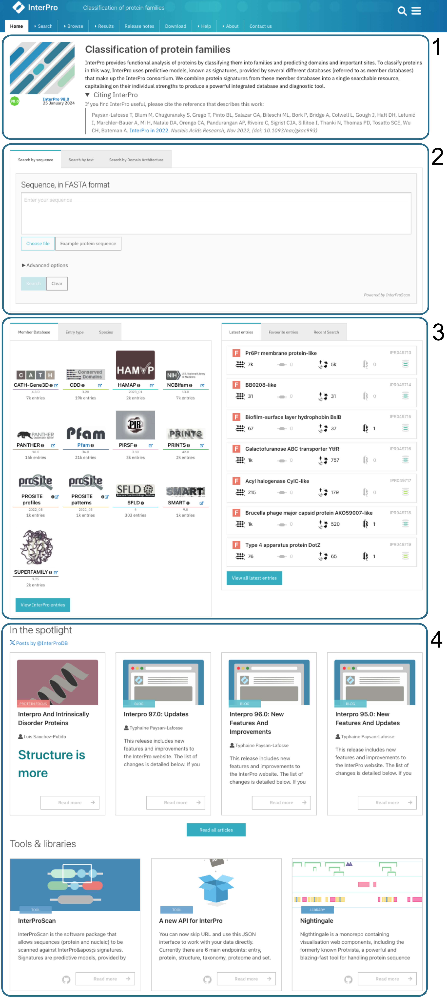
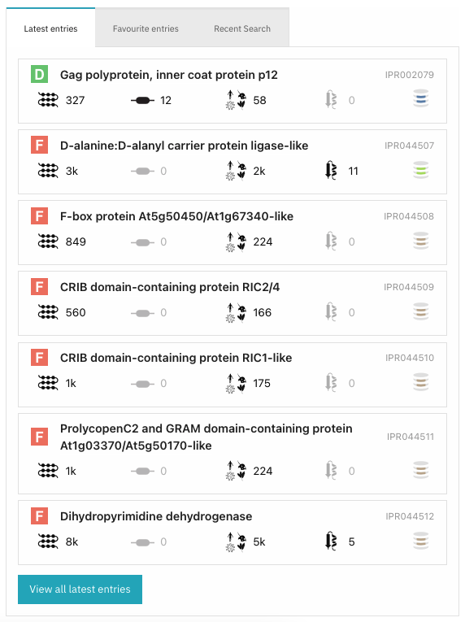

#################
InterPro homepage
#################

.. :ref:browse_feature searchways.html#browse-feature
.. :ref:entry_types entries_info.html#entry-types
.. :ref:taxonomy_page browse.html#taxonomy-page
.. :ref:entry_page browse.html#entry-page
.. :ref:entries browse.html#entries
.. :ref:proteins browse.html#proteins

The InterPro homepage can be split into in the following sections:

  
  InterPro homepage

#. :ref:`Overview`
#. :ref:`Search`
#. :ref:`Data`
#. :ref:`News`

|
|
|
|
|
|
|
|
|
|
|
|
|
|
|
|
|
|
|
|
|
|
|
|
|
|
|
|
|
|
|
|
|
|
|
|

.. _Overview:

**************************
InterPro resource overview
**************************

This section (section 1 in the figure above) gives an overview of the InterPro resource and a link to
the latest InterPro publication.
The release version and date are displayed under the graphic, the user can click on it to access 
the :doc:`Release notes </release_notes>`. 

.. .. figure:: images/homepage/homepage_summary.png
..   :alt: Homepage summary component

.. _Search:

**********
Search box
**********

The search section (section 2 in the figure above) shows a multifunctional search component, 
which allows the selection of one of the five types of search supported by InterPro. More 
details about searching are available on the :doc:`/searchways` section.

.. figure:: images/homepage/homepage_search.png
..   :alt: Homepage search component

.. _Data:

****
Data
****

The data section (section 3 in the figure above) gives an overview of InterPro data with shortcuts 
to different views of the data, and highlights the latest InterPro entries on the right hand side.

Member databases
================
.. figure:: images/homepage/homepage_member_database.png
  :alt: Homepage member database component
  :align: left
  :width: 350px
  :figclass: align-left

This section shows icons for the :doc:`/databases`, along with information about the version of the member 
database and an estimate of the number of signatures from that resource which are in the current InterPro 
release. Each of the member database icons links to the :ref:`browse feature<browse_feature>` showing data 
filtered to match the selected member database.

|
|
|
|
|
|
|
|
|
|
|

Entry type component
====================
.. figure:: images/homepage/homepage_entry_type.png
  :alt: Homepage entry type component
  :align: left
  :width: 350px
  
This section shows the icon and number of entries for each of the InterPro entry types 
Clicking on an icon will display the browse feature showing InterPro data filtered by the selected entry type.

This component shows icons for :ref:`entry_types`. An estimate of the number
of entries corresponding to each type is shown under each icon. Clicking on an
icon will display the :ref:`browse feature component <browse_feature>` showing InterPro data filtered by the
selected entry type.

|
|
|

Species component
=================
.. figure:: images/homepage/homepage_species.png
  :alt: Homepage species component
  :align: left
  :width: 350px

The Species component shows a set of icons corresponding to several key
species and an estimate of the number of entries and proteins associated with
each species. Clicking on an icon will display the associated :ref:`taxonomy_page` 
for the selected organism. Clicking on the text below the icon will display 
the :ref:`entries` or :ref:`proteins` tabs, respectively.

|
|
|
|
|
|
|
|
|

Latest Entries component
========================

Here we show a list of the latest InterPro entries with their entry type, 
followed by their name and accession number. The clickable icons beneath the text 
show the number of proteins, domain architectures, taxa, structures and member 
databases matching the entry. Each of the icons is clickable and provides a shortcut 
to the corresponding section of the :ref:`entry_page`.

|
|
|
|
|
|
|
|
|
|

.. _favourite:

Favourites Entries component
============================

This section provides a quick access to the list of favourite InterPro entries previously 
selected by clicking on the star icon in an InterPro entry page.

When a new version of InterPro has been released and one or more the Favourite entries 
have been updated, a button "**Check for updates**" is displayed. 

When clicking on it, differences 
for each updated entry are displayed in a github diff style. 
The user can choose to apply the update or keep the previous annotation.

.. _recent:

Recent search component
=======================

When performing a Text search, the text is stored locally and accessible through this section, 
so the user can retrieve the data of interest easily the next time they visit the website. 
Unwanted saved Text searches can be removed by clicking on the cross icon, The "Clear History" button 
allows to clear the search history.

.. _News:

********************
News and information
********************

The final section of the homepage (section 4 in the *InterPro homepage* figure above) comprises components 
linking to the InterPro |xlogo| `feed <https://twitter.com/InterProDB>`_, the articles from the `InterPro Blog <https://proteinswebteam.github.io/interpro-blog/>`_ and
technical aspects of the website.

The **Spotlight** section shows a selection of the latest articles from the 
`InterPro Blog <https://proteinswebteam.github.io/interpro-blog/>`_. 
We publish a range of articles on the blog, from technical information about 
the resources run by the team to protein focus articles which deliver details about 
interesting entries from InterPro data.

The **Tools and libraries** section provides quick access to some of the tools and software 
used throughout the website.
