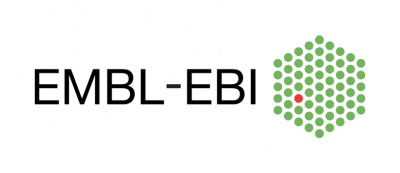
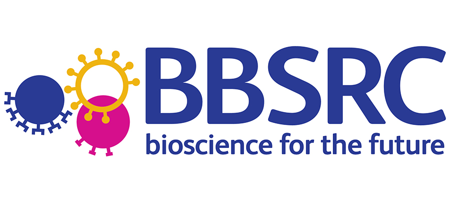

##########
About Pfam
##########

Pfam version 36.0 was produced at the `European Bioinformatics Institute <https://www.ebi.ac.uk/>`_ using a sequence database 
called *Pfamseq*, which is based on `UniProt <http://www.uniprot.org/>`_ release 2022_05.

Pfam is freely available under the `Creative Commons Zero <https://creativecommons.org/publicdomain/zero/1.0/>`_ ("CC0") licence.

Pfam is powered by the `HMMER3 <http://hmmer.org/>`_ package written by `Sean Eddy and his group <http://eddylab.org/>`_ 
at `HHMI <https://www.hhmi.org/>`_/ `Harvard University <https://www.mcb.harvard.edu/mcb/home/>`_.

.. |hv_logo| image:: images/logos/harvard_logo.png
  :alt: Harvard logo
  :width: 100px

|embl_logo| |hv_logo| |sbc_logo|  |biocomp_logo|

Pfam is supported by the following organisations:

  
EMBL is EMBL-EBI's parent organisation. It provides core funding (staff, space, equipment) for Pfam.

The Wellcome Trust has supported Pfam since the database inception, via core funding when based at the Wellcome Trust Sanger 
Institute. As well as providing and maintaining the campus on which the EMBL-EBI is located, the Wellcome Trust also now 
provides significant funding for Pfam (grant 221320/Z/20/Z). The current grant runs from October 2020 to September 2025.

BBSRC is supporting Pfam activities (BB/X012492/1) from January 2024 to December 2027, and has previously supported Pfam 
activities via grants BB/L024136/1, BB/N00521X/1, and BB/S020381/1.

  
The Howard Hughes Medical Institute supports the Eddy group.

|
Many organisations have supported Pfam activities in the past.

For more information, please contact the `Pfam helpdesk <https://www.ebi.ac.uk/support/pfam>`_.
