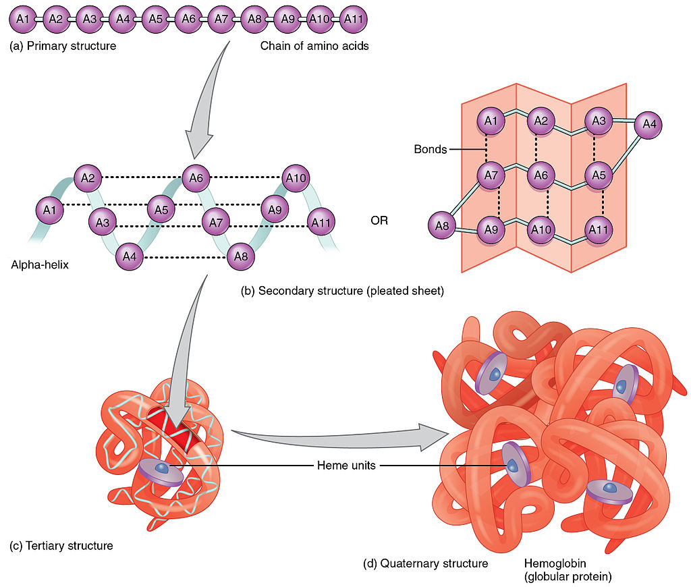

##########################
Protein families card game
##########################

*************************
Understanding the biology
*************************

What are proteins?
==================

A protein is a long chain-like molecule that is made up of small units known as amino acids, joined together by peptide bonds. 
You can visualise a protein as a pearl neckless where each pearl is an amino acid. These amino acids are found mainly in food. 
The proteins we eat are digested by our body to have each amino acid separated and used to form new proteins which are used by 
the cells to do their work. 

There are 20 amino acids. However, 9 of them are called "essentials" as they can't be produced by the human body and we obtain 
them by eating certain protein-rich foods (meat, poultry, fish, dairy products, eggs, and soy), hence it is important to have a 
good diet with enough protein intake. 

The primary structure of a protein is made of approximately 100 amino acids, but this number can vary. One of the smallest proteins 
is called Aspartame (it is an artificial sweetener used as a sugar substitute in foods and beverages) and is made of only 2 amino acids. 
On the contrary, the Titin protein is a giant protein made of 30,000 amino acids, it plays an important role in muscle elasticity.
The way amino acids are organised isn't random. Indeed, each sequence is very important, and if an amino acid is replaced by another one 
(by mistake) the protein might not work properly. The chains of amino acids are determined by DNA. To summarise, DNA provides the building 
instruction, the RNA is a copy of DNA which goes to the building site where the protein is built from the instructions using the amino acids.
The tertiary and quaternary structure of the proteins provide them with different functions. 

..   :width: 200px
..   :align: left

Figure 1. Illustration of the protein folding process from the amino acid sequence (a) to the quaternary structure (d).
Source: `OpenStax College - Anatomy and Physiology <https://openstax.org/books/anatomy-and-physiology/pages/2-5-organic-compounds-essential-to-human-functioning>`_

The video below explains how proteins are produced from the DNA sequence.

.. raw:: html

    

    <iframe width="560" height="315" src="https://www.youtube.com/embed/gG7uCskUOrA" title="YouTube video player" frameborder="0" allow="accelerometer; autoplay; clipboard-write; encrypted-media; gyroscope; picture-in-picture" allowfullscreen></iframe>
    

Source: `www.yourgenome.org <https://www.yourgenome.org/video/from-dna-to-protein/>`_

As you might have noticed, proteins are necessary for the body to work properly and represent about 60% of the components of a cell. 
They are always renewed and found in all living cells. They are essential for the cell function and responsible for diverse functions, 
like cellular structure (collagen), molecule transport (hemoglobin), cell activity regulators (insulin), helping molecules transformation.

Why are proteins classified?
============================
Proteins can be classified into groups when they have a similar chain of amino acids or a similar tertiary structure. 
These groups often contain well characterised proteins whose function is known. Thus, when a novel protein is identified, 
its functional properties can be proposed based on the group to which it is predicted to belong.

How are protein classified?
===========================
Proteins can be classified into different groups based on the families to which they belong, the domains they contain, or the 
sequence features they possess.

Protein family
--------------
A protein family is a group of proteins that share a common evolutionary origin (they have a common parent protein), we can identify 
them as they have related functions and similarities in their amino acid sequence or structure. 

**Example of a protein family: Nuclear hormone receptors**

Nuclear hormone receptors constitute an important family of transcription regulators that 
are involved in diverse physiological functions. Members of the family include the 
steroid hormone receptors and receptors for thyroid hormone, retinoids, vitamin D3 and many other ligands.
Nuclear hormone receptors are extremely important in medical research, a large number of them is being implicated 
in diseases such as cancer, diabetes, and hormone resistance syndromes.

.. figure:: images/protein_families_game/NR_family_members.png
  :alt: List of Nuclear hormone receptors
Figure 2. List of a few members of the Nuclear hormone receptors family obtained from InterPro `IPR001723 
<https://www.ebi.ac.uk/interpro/entry/InterPro/IPR001723/>`_.

.. figure:: images/protein_families_game/hr_structures.png
  :alt: Example of hormone receptors structures
Figure 2. 3D Structures of 4 Nuclear hormone receptors: Thyroid hormone (PDB `4lnw <https://www.ebi.ac.uk/interpro/structure/PDB/4lnw/>`_), 
Vitamin D (PDB `3a40 <https://www.ebi.ac.uk/interpro/structure/PDB/3a40/>`_), 
Retinoic acid (PDB `5k13 <https://www.ebi.ac.uk/interpro/structure/PDB/5k13/>`_)
and Estrogen (PDB `6vjd <https://www.ebi.ac.uk/interpro/structure/PDB/6vjd/>`_) receptors.

Protein domains
---------------
Domains are distinct functional and/or structural units in a protein. Usually, they are responsible for a particular function or 
interaction, contributing to the overall role of a protein. Domains may exist in a variety of biological contexts, where similar
domains can be found in proteins with different functions.

**Example of a protein domain: Globins**

Globins are involved in binding and/or transporting oxygen. They have evolved from a common ancestor and can be divided into three groups: 
single-domain globins, and two types of chimeric globins, flavohaemoglobins and globin-coupled sensors.

The major types of globins include:

 - Neuroglobin is found in vertebrate brain and retina
 - Hemoglobin transports oxygen from lungs to other tissues in vertebrates
 - Protoglobin is found in archaea
 - Cytoglobin is an oxygen sensor
 - Leghemoglobin is found in leguminous plants
 - Flavohemoglobin provides protection against nitric oxide
 - Myoglobin is responsible for oxygen storage in vertebrate muscle
 - Globin-coupled sensors
 
.. figure:: images/protein_families_game/globins_structures.png
  :alt: Globins structures
..   :width: 200px
..   :align: left

Figure 4. Cartoon representation of the globins domains structures generated using `mol* <https://molstar.org/viewer/>`_.
They are all made of eight alpha helices.

Family- and domain-based classifications are not always straightforward and can overlap, since proteins are sometimes assigned to 
families by virtue of the domain(s) they contain.

Sequence features
-----------------
Sequence features are groups of amino acids that confer certain characteristics upon a protein, and may be important for its overall 
function. Sequence features differ from domains in that they are usually quite small (often only a few amino acids long), whereas 
domains represent entire structural or functional units of the protein. Sequence features are often nested within domains.

Protein classification in InterPro
==================================
Multiple groups of scientists work on protein classification and are using different methods and criteria to generate their 
categorisation. InterPro is the main resource for protein classification at the European Bioinformatic Institute. It regroups 
the protein classification from multiple databases into a single searchable resource. Having all this information available in 
a single location is very convenient and time saving for the scientific community, as the researchers don't have to look for 
information in different places. InterPro also provides a tool, called InterProScan, to help the function prediction of newly 
discovered proteins.

*********************
Protein families game
*********************

The Protein families game contains 42 cards divided in 7 families (6 protein cards each), the goal is to collect the maximum number 
of families by asking the other players for the protein cards you are missing in your hand to complete your families. The game logic 
is similar to the Happy families and Go Fish games.

The game is available to play online by clicking on the image below, or you can `request a printed copy <https://www.ebi.ac.uk/about/contact/support/interpro>`_.

.. raw:: html

  

  <iframe src="https://tabletopia.com/games/protein-families/680x340" width="680" height="340" frameborder="0" allowtransparency="true" scrolling="no"></iframe>
  

|
*********************
Ask questions
*********************

Do you have questions about protein or protein classification or would like a printed copy of the game? `Send us your question(s) <https://www.ebi.ac.uk/about/contact/support/interpro>`_.