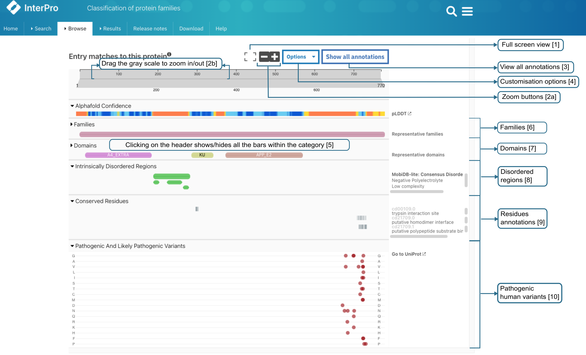
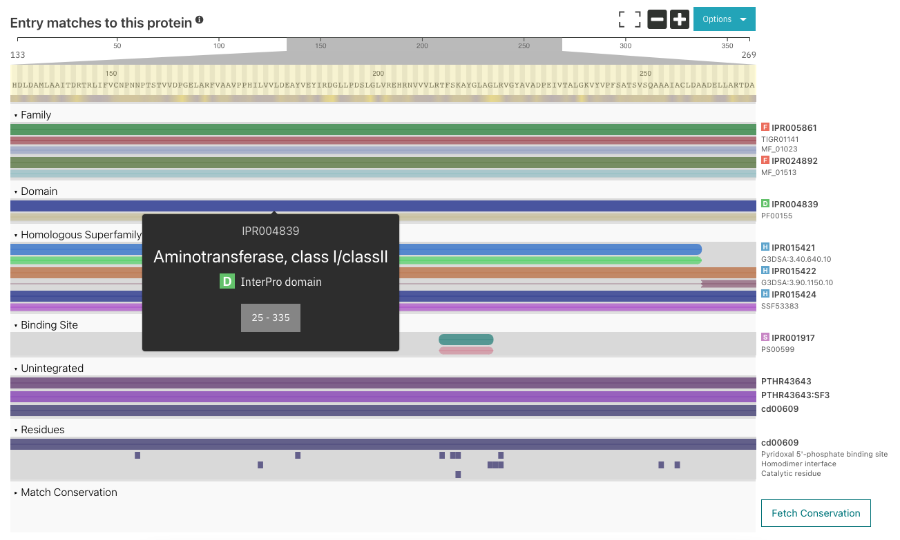

#######################
Protein sequence viewer
#######################

A common element on several InterPro website pages is the protein sequence viewer (in the 
:ref:`sequence search result <sequence_search>`, on the :ref:`protein <protein_page>` and 
:ref:`structure <structure_page>` pages). It summarises the InterPro entries (IPR) and 
member database signatures matches to the protein or structure
being looked at, represented by the grey bar at the top of the viewer. 

The *AlphaFold or BFVD confidence* track is displayed in the protein sequence viewer in the :ref:`protein page <protein_page>` 
and in the :ref:`AlphaFold subpage <alphafold1>` or :ref:`BFVD subpage <pBFVD>` when a predicted structure is available.

By default, a summarised view of the InterPro entries (IPR) and member database signatures matches is displayed.
It provides information about the protein family membership in the Families category ([6] in the figure below, only 
the representative families are shown), the different domains that compose the protein in the Domains category (both 
the representative domains and the `TED domains <https://ted.cathdb.info/>`_ are shown) [7], Intrinsically disordered regions from 
`MobiDB-lite <https://www.mobidb.org/>`_ and `DisProt <https://www.disprot.org/>`_ [8], conserved residues provided by 
the CDD, SFLD and PIRSR databases [9] and pathogenic variants [10] are also displayed when available.

The top line in the *Domains* and *Families* categories shows a summary representation generated automatically using 
the type of the member databases models, which might differ from the InterPro entries types. More information about 
the selection process can be found in the :doc:`represent_dom` page.

Information about pathogenic and likely pathogenic residue variants in protein sequences is available under the 
*Pathogenic And Likely Pathogenic Variants* category of the viewer. Please note that the data can differ from the 
data provided on the UniProt website as we are applying a *Clinical significance* filter, which is different from 
the one used by UniProt. 

.. protein used: https://wwwdev.ebi.ac.uk/interpro/protein/UniProt/P05067/

  Summary view of the InterPro annotations of a protein.

Various options make it easy to work with (as illustrated in the figure above):

1. Clicking on the Full screen button at the top of the viewer will switch to full screen view.

2. The viewer can be zoomed in and out by:

  a. Clicking the two buttons (+ and -) at the top right corner.
  b. Dragging the grey scale at the top to the desired positions on both left and right sides
  c. Pressing the [Ctrl] key and scroll through the viewer 

3. The viewer can be collapsed or expended to display a *Summary* (default) or the *Full* list of annotations by selecting the 
relevant option under **Feature Display Mode**. The selected view preference is saved in your browser settings, ensuring consistent 
display throughout the website (you can try it for `P05067 <https://www.ebi.ac.uk/interpro/protein/UniProt/P05067/>`_ shown in the 
figure above). Data included in the Full view, when available:

- Expanded view of the Families matches. This section includes the representative families and the matches of InterPro entries type family and unintegrated member database models type Family

- Expanded view of the Domains matches. This section includes: 

  - the representative domains
  - the predicted domains from The Encyclopedia of Domains (`TED <https://ted.cathdb.info/>`_)
  - the matches of InterPro entries type domain, repeat or homologous superfamily
  - the matches of unintegrated member database models type domain, repeat or homologous superfamily
  - RepeatsDB tandem repeat annotations from `RepeatsDB <https://repeatsdb.bio.unipd.it/>`_. Individual repeated units are now displayed in red and blue, with any insertions marked in yellow.

- Intrinsically Disordered Regions:

  - Disordered regions predicted by `MobiDB-lite <https://www.mobidb.org/>`_
  - Intrinsically disordered proteins from `DisProt <https://www.disprot.org/>`_. The DisProt regions are coloured based on their structural aspect, as defined by the Intrinsically Disordered Proteins Ontology (brown: structural state; purple: structural transition; red: disorder function).

- Conserved, Active and Binding sites
- Conserved residues from CDD, SFLD and PIRSR
- Pathogenic and likely pathogenic variants
- Coiled-coils from COILS, Signal peptides from `SignalP <https://services.healthtech.dtu.dk/service.php?SignalP-5.0>`_ and/or Phobius, Transmembrane regions from `Phobius <https://phobius.sbc.su.se/>`_ and/or `TMHMM <https://services.healthtech.dtu.dk/service.php?TMHMM-2.0>`_.
- Cytoplasmic/non-cytoplasmic domains from Phobius
- Post-translational modifications from `Pride <https://www.ebi.ac.uk/pride/>`_ and `Prosite <https://prosite.expasy.org/>`_
- Spurious proteins from :doc:`AntiFam </antifam>`
- `Funfam <https://github.com/UCLOrengoGroup/cath-funfam-docs>`_, provided by CATH-Gene3D, is an automatically generated profile HMM database, with FunFams entries segregated by an entropy-based approach  that distinguishes different patterns of conserved residues, corresponding to differences in functional determinants.
- Short linear motifs from `ELM <http://elm.eu.org/>`_

4. More options that customise the viewer are grouped under **Options** dropdown.

.. figure:: images/protein_viewer/pv_options_dropdown.png
  :alt: Protein sequence viewer options
  :align: left
  :width: 350px

A. **Colour By** allows to change the colours in which the InterPro entries and signatures bars based on accession, member database or domain 
relationship. 

B. The labels on the right side of the viewer can be customised. The **Accession** labels are shown by default. To see names and/or short names 
along with accession, the name/short name checkboxes should be ticked or if the user prefers to see the names/short names alone, the respective 
options should be selected.

|
|
|
|
.. _InterPro-N_display_modes:

C. There are four alternative **display matches** modes:

  - Default: the protein sequence viewer displays “traditional” InterPro matches, supplemented by novel InterPro‐N matches. When both methods report a match, the InterPro annotation is retained unless the InterPro‐N one is at least 5% longer
  - InterPro: displays only the “traditional” InterPro annotations
  - InterPro-N: displays only InterPro-N predictions
  - Stacked: when both InterPro and InterPro-N report a match, both annotations are displayed vertically stacked. This is the optimal display mode for visual comparison of coexisting InterPro and InterPro‐N matches, but please note it may result in a crowded view of the domain viewer showing a high number of annotations.

D. **Save as image** allows to take a snapshot of the viewer and is saved as an image (.png).

E. The tooltips are shown when hovering over each bar. They contain the signature accession and name, and the InterPro entry accession when the signature is integrated in an InterPro entry, which can be clicked on to access the InterPro entry page. The tooltips can be disabled by unchecking the **Tooltip Active** option.

  Tooltip example.

5. Clicking on the header of a category expends or hides the matches for the entire category.

When zoomed in, panning can be achieved by either dragging the scale at the top or by dragging any bar in the desired direction (see figure above).

InterPro-N
**********
InterPro-N is a collection of InterPro matches predicted using deep learning. It has been trained on data from the current release, with inferences made against 
the last UniProtKB version available, ensuring that both InterPro and InterPro-N are in perfect sync.

InterPro-N predicted matches are distinguished by a leading sparkles icon (|sparkles_icon|) on the right hand label in the protein sequence viewer and by a top right 
superscript (|interpro-n_tag|) on the InterPro or member database accession number in the tooltip.

.. note::
  InterPro-N predictions are not yet available for PDBe chain sequences, protein isoforms, or sequences submitted through the InterProScan web search.