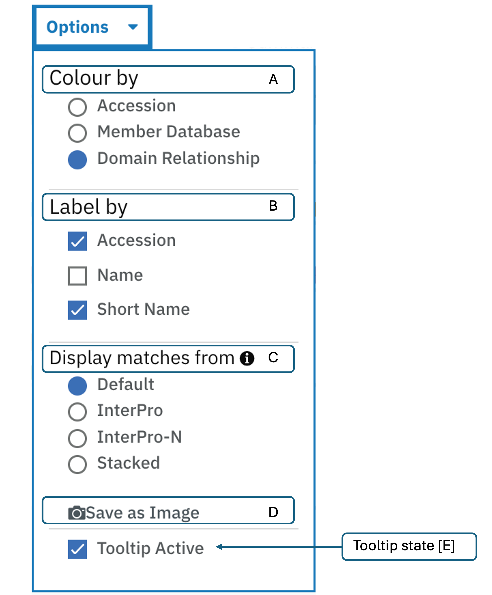
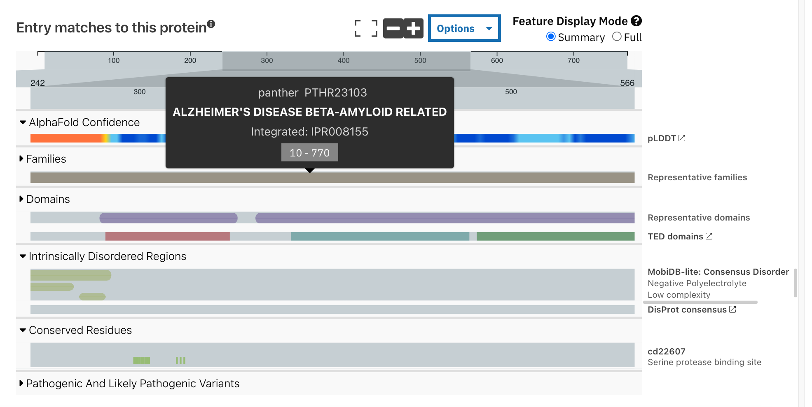

**************
Protein sequence viewer
**************

.. :ref:sequence_search searchways.html#sequence-search
.. :ref:protein_page browse.html#protein-page
.. :ref:structure_page browse.html#structure-page
.. :ref:entry_types entries_info.html#entry-types

A common element on several InterPro website pages is the protein sequence viewer (in the 
:ref:`sequence search result <sequence_search>`, on the :ref:`protein <protein_page>` and 
:ref:`structure <structure_page>` pages). It summarises the InterPro entries (IPR) (top 
track) and member database signatures matches to the protein or structure
being looked at, represented by the grey bar at the top of the viewer. 

.. figure:: images/protein_viewer/pv_help.png
  :alt: Protein sequence viewer
  :width: 800px

The matches are displayed in different categories classified by :ref:`entry_types`. 
Various options, make it easy to work with:

1. Clicking on the Full screen button at the top of the viewer will switch to full screen view.
2. The viewer can be zoomed in and out by:
  a. Clicking the two buttons (+ and -) at the top right corner.
  b. Dragging the grey scale at the top to the desired positions on both left and right sides
  c. Pressing the [Ctrl] key and scroll through the viewer 
3. More options that customise the viewer are grouped under **Options** dropdown.

A. **Colour By** allows to change the colours in which the tracks are displayed by accession, member database or domain relationship. 

B. The labels on the right side of the viewer can be customised. The accession labels are shown by default. To see names along with accession, the name checkbox should be ticked or if the user prefers to see the names alone, the respective options should be selected.

C. **Snapshot** has two options: **Save as image** allows to take a snapshot of the viewer and is saved as an image (.png). **Print** allows the user to print the viewer, thus supporting the download in PDF format.

D. **Collapse All** allows to collapse all the child tracks displayed in the viewer at once to only display the InterPro entry level. 

.. figure:: images/protein_viewer/pv_collapsed_tracks.png
  :alt: Protein sequence viewer collapsed
  :width: 800px

  Collapsed tracks view.

E. The tooltips are shown when hovering over each bubble. They can be disabled by unchecking the **Tooltip Active** option.

  Tooltip example.

4. On the :ref:`protein_page`, clicking on the **Fetch conservation** button, will display the conservation information based on the Pfam signatures.

.. figure:: images/protein_viewer/pv_conservation.png
  :alt: Protein sequence viewer conservation track
  :width: 800px

Clicking on the header of a category (say Unintegrated) hides the tracks for the entire category.

When zoomed in, panning can be achieved by either dragging the scale at the top or by dragging any track in the desired direction (see figure below).

.. figure:: images/protein_viewer/pv_panning.png
  :alt: Protein sequence viewer panning
  :width: 800px

