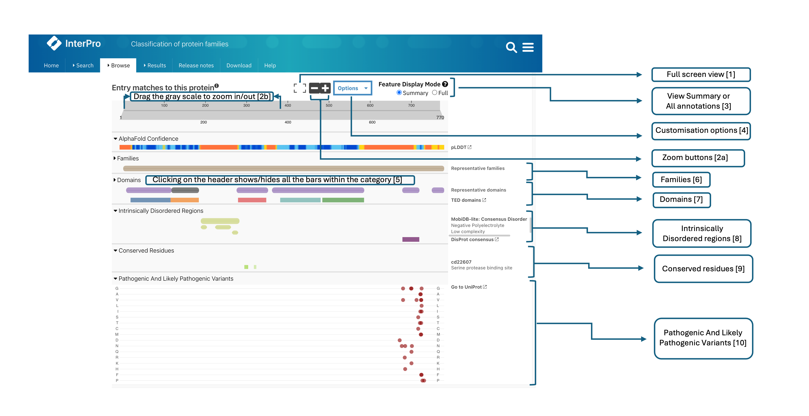

***********************
Protein sequence viewer
***********************

.. :ref:sequence_search searchways.html#sequence-search
.. :ref:protein_page browse.html#protein-page
.. :ref:structure_page browse.html#structure-page
.. :ref:entry_types entries_info.html#entry-types
.. :ref:signature browse.html#signature

A common element on several InterPro website pages is the protein sequence viewer (in the 
:ref:`sequence search result <sequence_search>`, on the :ref:`protein <protein_page>` and 
:ref:`structure <structure_page>` pages). It summarises the InterPro entries (IPR) (top coloured
bar) and member database signatures matches to the protein or structure
being looked at, represented by the grey bar at the top of the viewer, categorised by :ref:`entry_types`. 

.. The purple/grey bar below the amino acids indicates the predicted hydrophobicity of the sequence residues. 
.. When zoomed in at the residue level and hovering, a tooltip shows hydrophobicity score, using the 
.. `Wimley–White whole residue hydropathy scale <https://en.wikipedia.org/wiki/Hydrophobicity_scales>`_  
.. (the more positive the value, the more hydrophobic is the amino acid). 
.. The colour scale varies from -3 (coloured as bright blue) for hydrophilic residues and 3 (coloured as 
.. bright yellow) for hydrophobic ones.

The AlphaFold confidence track is displayed in the protein sequence viewer in the :ref:`protein page <protein_page>` 
and in the :ref:`AlphaFold subpage <alphafold1>` when a predicted structure is available.

.. protein used: https://www.ebi.ac.uk/interpro/protein/UniProt/A0Q9F3/

Various options, make it easy to work with (as illustrated in the figure above):

1. Clicking on the Full screen button at the top of the viewer will switch to full screen view.

2. The viewer can be zoomed in and out by:

  a. Clicking the two buttons (+ and -) at the top right corner.
  b. Dragging the grey scale at the top to the desired positions on both left and right sides
  c. Pressing the [Ctrl] key and scroll through the viewer 

3. More options that customise the viewer are grouped under **Options** dropdown.

.. figure:: images/protein_viewer/pv_options_dropdown.png
  :alt: Protein sequence viewer options
  :align: left
  :width: 350px

A. **Colour By** allows to change the colours in which the InterPro entries and signatures bars based on accession, member database or domain relationship. 

B. The labels on the right side of the viewer can be customised. The **Accession** labels are shown by default. To see names and/or short names along with accession, the name/short name checkboxes should be ticked or if the user prefers to see the names/short names alone, the respective options should be selected.

C. **Snapshot** has two options: **Save as image** allows to take a snapshot of the viewer and is saved as an image (.png). **Print** allows the user to print the viewer, thus supporting the download in PDF format.

D. **Collapse All** allows to collapse all the signatures bars displayed in the viewer at once to only display the InterPro entries bars. 

.. figure:: images/protein_viewer/pv_collapsed_tracks.png
  :alt: Protein sequence viewer collapsed
  :width: 800px

  Collapsed categories view.

E. The tooltips are shown when hovering over each bar. They can be disabled by unchecking the **Tooltip Active** option.

.. figure:: images/protein_viewer/pv_tooltip.png
  :alt: Protein sequence viewer tooltip
  :width: 800px

  Tooltip example.

4. Residues annotations are provided by the CDD, SFLD and PIRSR databases.

5. On the :ref:`protein_page`, clicking on the **Fetch conservation** button, will display the conservation information based on the PANTHER signatures. 
The conservation scores are generated using the following process: 

- The HMM model from the PANTHER database is run against the SwissProt database using hmmsearch, generating an HMM profile and a :ref:`logo <signature>` (graphical representation of the amino acid conservation).
- The conservation score for each residue is determined, from the logo data, using the following formula: :math:`\frac {\sum (height\_arr)} {max\_height\_theory} \times 10`
- The model is aligned against the protein sequence.

.. figure:: images/protein_viewer/pv_conservation.png
  :alt: Protein sequence viewer conservation track
  :width: 800px

6. Clicking on the header of a category (say Unintegrated) hides the bars for the entire category.

When zoomed in, panning can be achieved by either dragging the scale at the top or by dragging any bar in the desired direction (see figure below).

.. figure:: images/protein_viewer/pv_panning.png
  :alt: Protein sequence viewer panning
  :width: 800px

For some proteins, additional information are provided by resources other than the member 
database consortium, they are displayed under the **Other features** category of the viewer.
Available data include:

- Disordered regions from `MobiDB <https://www.mobidb.org/>`_
- Transmembrane regions from `Phobius <https://phobius.sbc.su.se/>`_ and/or `TMHMM <https://services.healthtech.dtu.dk/service.php?TMHMM-2.0>`_
- Coiled regions from COILS
- Cytoplasmic/non-cytoplasmic domains from Phobius
- Signal peptide regions from `SignalP <https://services.healthtech.dtu.dk/service.php?SignalP-5.0>`_ and/or Phobius
- Spurious protein from `AntiFam <https://www.ebi.ac.uk/research/bateman/software/antifam-tool-identify-spurious-proteins>`_
- `CATH-FunFams <https://github.com/UCLOrengoGroup/cath-funfam-docs>`_ is an automatically generated profile HMM database, with FunFams entries segregated by an entropy-based approach  that distinguishes different patterns of conserved residues, corresponding to differences in functional determinants
- `Pfam-N annotations <https://xfam.wordpress.com/2022/10/20/a-new-version-of-pfam-n-is-available>`_ result from a deep learning methodology developed by the Google Research team led by Dr Lucy Colwell to increase the Pfam coverage of protein sequences

When available, 3D structure and domain predictions from the `Genome3D consortium <http://genome3d.net/resource>`_ are displayed in the
**Predicted 3D Structures** and **Predicted Domains** categories respectively.

.. figure:: images/protein_viewer/pv_other_features.png
  :alt: Protein sequence viewer Other features and Genome3D annotations for the protein O75069
  :width: 800px

  Protein sequence viewer Other features and Genome3D annotations for `O75069 <https://www.ebi.ac.uk/interpro/protein/UniProt/O75069//>`_