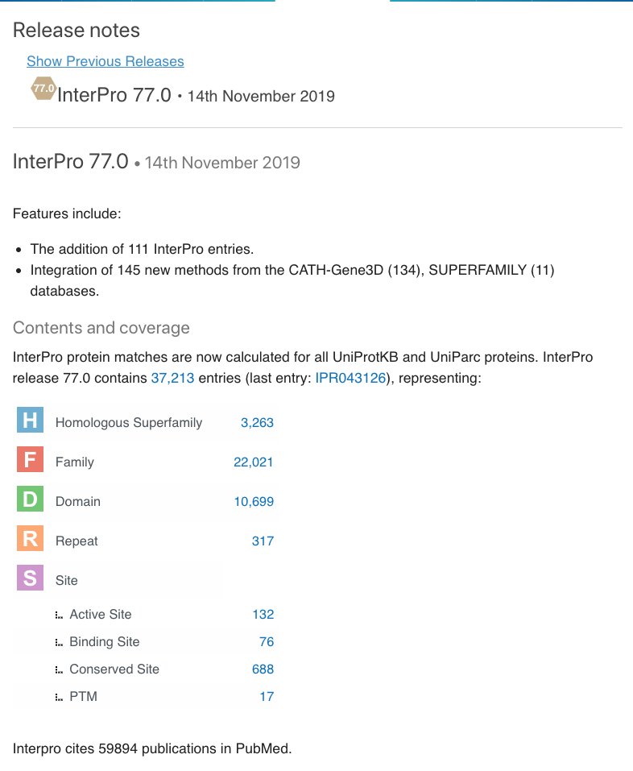
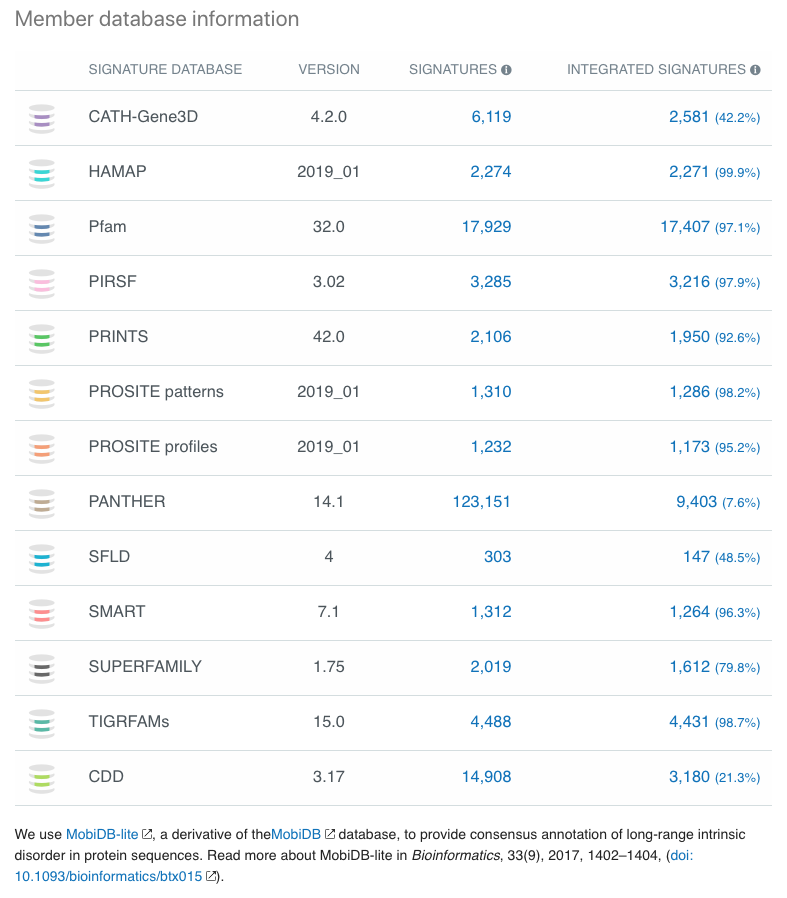

#############
Release Notes
#############

This page shows various statistics about current and previous versions
of InterPro
`InterPro release notes page <https://www.ebi.ac.uk/interpro/release_notes/>`_

*******************
General information
*******************

The section at the top of the page gives details about the release version and
date together with changes made in this release.

****************
Other statistics
****************

We present a range of statistics covering member databases, GO annotation,
information about Proteins, Structures, Proteomes, Taxonomy and Sets. More
information about these data can be found in the :doc:`/browse` section of the
website.

