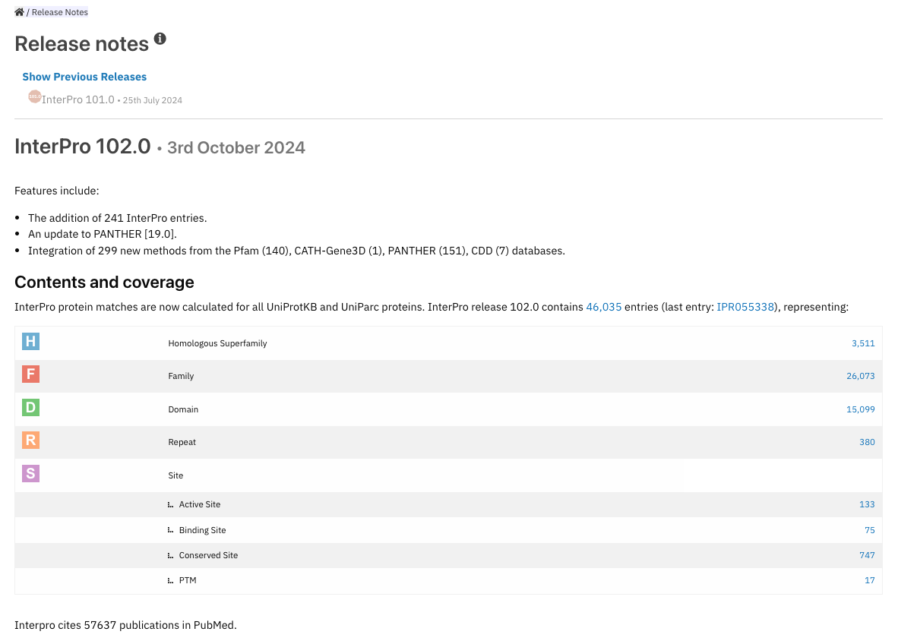
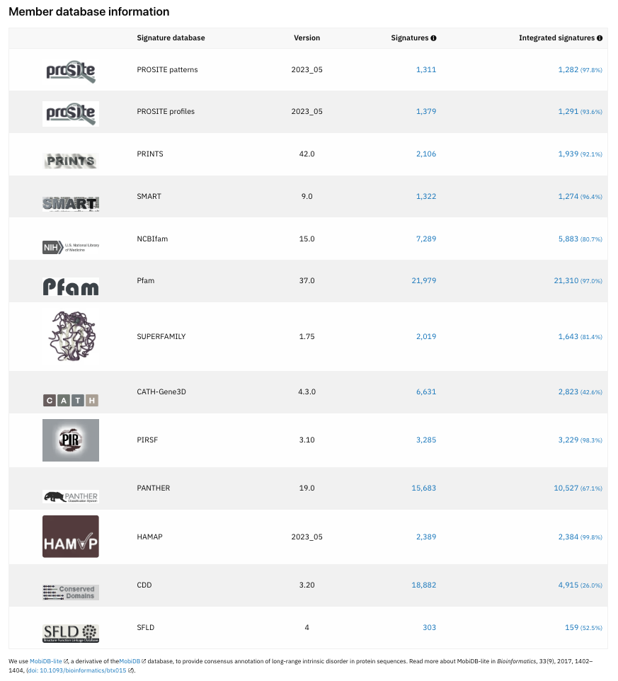

#############
Release notes
#############

InterPro is updated approximately every 8 weeks.
The `release notes page <https://www.ebi.ac.uk/interpro/release_notes/>`_ provides 
information about the current InterPro release.

*******************
General information
*******************

The section at the top of the page gives details about the release version and
date together with changes made in this release.

****************
Other statistics
****************
A range of statistics covering member databases, GO annotation, information about Proteins, 
Structures, Proteomes, Taxonomy and Sets are also available on this page. 

