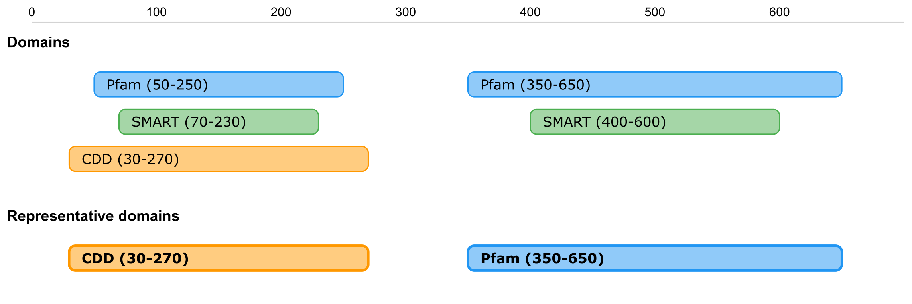

Representative Domain and Family selection
###############################

InterPro selects representative domains and families from protein signatures to provide a non-redundant view of protein features. This section describes the selection criteria and process.

Representative Domain selection
*******************************

Member database type filtering
==============================
The selection process begins by filtering protein signatures based on their signature type in the member database. Only signatures classified as domains or repeats are considered for representative domain selection, while other types such as families and sites are excluded from this process. It's important to note that this signature type may differ from the InterPro entry type in which the signature has been integrated. The representative domain selection strictly uses the original signature type from the member database, not the InterPro entry type. This approach maximizes the coverage of protein length by considering all eligible signatures, including those that haven't been integrated into InterPro entries.

Eligible member databases
=========================
Representative domains are selected exclusively from a specific set of member databases: Pfam, CDD, PROSITE profiles, SMART, and NCBIfam. These databases have been chosen based on their reliability and coverage of domain annotations.

Selection process
=================
The selection of representative domains follows a systematic approach that begins with initial filtering of signatures. The system first narrows down the candidates by including only domain and repeat types from the eligible member databases listed above.

The next step involves location-based grouping of the signatures. For each protein, the system sorts signatures according to their locations on the protein sequence. Signatures that share any positions on the protein sequence are considered overlapping and are grouped together for further processing.

Within each group of overlapping signatures, the system selects the longest signature as the representative domain. The length is determined by calculating the number of positions the signature covers on the protein sequence. This approach ensures that the most comprehensive domain annotation is chosen to represent each region.

.. note::
    It's important to note that the representative domain selection is protein-specific, meaning that the same signature might be selected as representative in one protein but not in another. This dynamic selection ensures the most appropriate representation for each specific protein context, taking into account the unique characteristics and structure of each protein.

Key considerations
==================
The selection process is designed to be deterministic for a given protein and set of matches, ensuring consistency in results. However, as member databases are updated, the selection results may change to reflect latest annotations. The protein-specific nature of the selection process means that domain representation can vary across different proteins, providing the most contextually appropriate annotations for each case.

Examples
========
**Example 1: Distinction between signature and InterPro types**

Consider an InterPro entry IPR123456 of type 'family' that contains two overlapping signatures:

#. A Pfam signature (positions 15-90)

   * Signature type: domain

   * Integrated in InterPro family entry IPR123456

   * Length: 75 AA

#. A CDD signature (positions 10-100)

   * Signature type: family

   * Integrated in same InterPro family entry IPR123756

   * Length: 90 AA

#. A SMART signature (positions 20-110)

   * Signature type: domain

   * Integrated in different InterPro domain entry IPR874321

   * Length: 90 AA

This example illustrates that even though Pfam and CDD signatures are integrated in the same InterPro family entry, only the Pfam signature is eligible for representative domain selection because it is of type 'domain'. The CDD signature, despite being in the same InterPro entry and covering a longer region, is excluded because its signature type is 'family'. The SMART signature, though in a different InterPro entry, is also considered because it is of type 'domain'. Between the two eligible signatures, SMART would be selected as representative because it covers a longer region (90 vs 75 amino acids (AA) in length).

**Example 2: Multidomain protein**

Consider a protein with multiple domain regions and the following signatures:

- Region 1 (N-terminal):

    - Pfam domain: positions 50-250
    - SMART domain: positions 70-230
    - CDD domain: positions 30-270

- Region 2 (C-terminal):

    - Pfam domain: positions 350-650
    - SMART domain: positions 400-600

In this case, two representative domains would be selected:

#. The CDD domain for Region 1, as it covers the longest region (240 AA)

#. The Pfam domain for Region 2, as it covers the longest region (300 AA)

    
    Example of a representative domain selection process for a multidomain protein.

The diagram above illustrates how overlapping domains are grouped and representative domains are selected for each region. Note that different member database signatures can be selected as representative in different regions of the same protein.

Representative Families selection
*********************************

The process for selecting representative families follows similar principles to domain selection, but considers signatures of type 'family' instead of 'domain' or 'repeat'. Like domain selection, it uses the signature type from member databases rather than the InterPro entry type. Representative families are selected from the following member databases: Pfam, PIRSF, PANTHER, NCBIfam, HAMAP and SFLD. When signatures overlap, the longest one is selected as representative, ensuring comprehensive coverage of the protein sequence.

Technical corner
****************

Implementation
==============
The selection logic is implemented in the `select_repr_domains` function within the `InterPro Github codebase <https://github.com/ProteinsWebTeam/interpro7-dw/blob/main/interpro7dw/interpro/oracle/matches.py>`_. This function processes protein matches systematically to determine representative domains based on the criteria described above.

Availability Through the InterPro API
=====================================
Representative domains can be accessed through the InterPro API. For each protein entry, the API response includes a 'representative' field set to true or false in the JSON output. This field indicates whether a particular signature has been selected as representative for that protein.

Example API endpoint: https://www.ebi.ac.uk/interpro/api/entry/pfam/protein/reviewed/O09185/

In the JSON response, each match contains a 'representative' field:

.. code-block:: json
    :emphasize-lines: 20

    {
    "results": [
        {
        "metadata": {
            "accession": "PF00001",
            "name": "Example Domain",
            "type": "domain"
        },
        "proteins": [
            {
            "signature": {...},
            "entry_protein_locations": [
                {
                "fragments":[
                    {
                    "start": 10,
                    "end": 100
                    }
                ],
                "representative": true  // Indicates a representative match
                }
            ],
            }
        ],
        }
    ],
    }