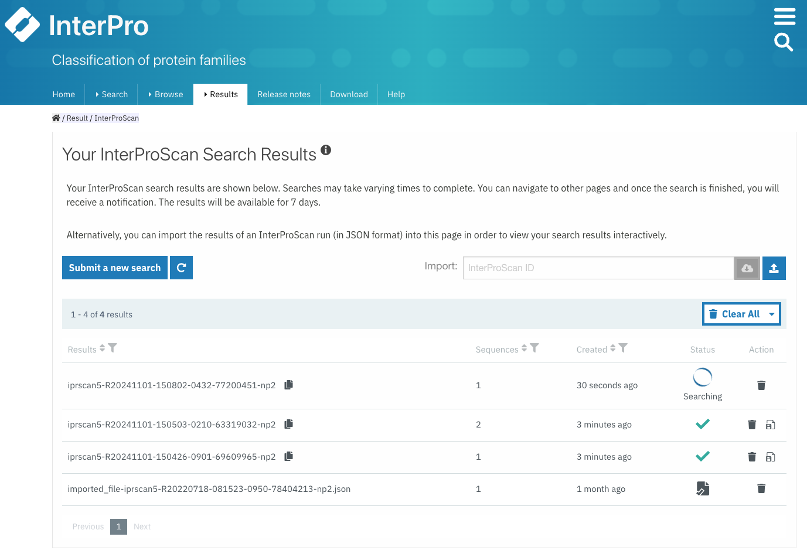
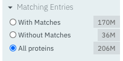

###########
How to search the InterPro website?
###########
A search can be performed on the :doc:`/homepage` using the :ref:`Search` component, by clicking on the Search tab in the 
:ref:`navigation menu <navigation_menu>`, 
or by clicking on the magnifying glass in the :ref:`navigation banner <navigation_banner>`. 
There are five different types of search available in InterPro:

- :ref:`quick_search`
- :ref:`sequence_search`
- :ref:`text_search`
- :ref:`domain_arch_search`
- :ref:`browse_feature`

.. _quick_search:

**************
Quick search
**************

.. figure:: images/banner/navigation_search_box.png
  :alt: Quick search component
  :width: 200px
  :align: left

The magnifying glass in the navigation banner allows a quick search for a specified keyword. 
A search can be triggered by entering some text and pressing the enter/return key or clicking 
the magnifying glass. If the keyword is text, the results will be displayed as described in 
the :ref:`text_search`. If the keyword entered is an accession, it automatically redirects to the 
corresponding :doc:`InterPro page </browse>` under the **Browse** tab in the :ref:`navigation menu <navigation_menu>`. 

.. _sequence_search:

***************
Sequence search
***************

A sequence can be submitted in FASTA format in the dedicated text area or by uploading a fasta file. 
The “**Advanced options**” allows users to select the InterPro member databases of interest to search 
against (by default they are all selected). The sequence search is performed using the :doc:`InterProScan software </interproscan>`.

.. figure:: images/search/seq.png
  :alt: Sequence search component

.. _sequence_search_results:

Sequence search results
=======================
Results of a protein sequence search are available under the **Results** tab in the navigation menu in 
the **Your InterProScan Searches** section. This page displays the protein sequence searches you have 
performed in the last seven days, with the most recent one being displayed at the top. The status 
column gives an indication of whether or not the search has completed (green tick symbol / searching). 
Clicking on the text in the results column opens a page where the results are summarised in a 
protein sequence viewer (more detailed information is provided for the :doc:`/protein_viewer`)

  Summary of sequence searches jobs.

.. figure:: images/search/sequence_search_result.png
  :alt: Sequence search viewer
  :width: 800px

  Example of protein sequence viewer as displayed in the search result page.

On the search results page, some general information on the submitted sequence is provided, 
followed by the predicted InterPro protein family membership when available ([1] in the figure above).
The sequence submitted is shown in its full length at the top of the protein sequence viewer (grey bar) [2]. 
The purple / yellow bar below indicates the predicted hydrophobicity of the sequence residues [3]. 
This is followed below by InterPro entries and signatures matches, displayed in categories classified by :doc:`InterPro 
entry types </entry_types>`. Each coloured bubble represents a domain, protein family, or important site that has been 
matched to part or all the length of the submitted protein sequence. 

- The top coloured bubble represents the InterPro entry [4a, 5a].
- Directly below the InterPro entry, additional coloured bubbles display the member database signatures that contributed to that InterPro entry [4b, 5b]. 

In the example above, four InterPro entries (1 family and 3 domain entries) have been found matching the 
submitted sequence. The first InterPro entry is for a protein family [4a], containing one member database 
signature, in this case from Prosite (PR01022) [4b]. The following three InterPro matches are domains. 
The top InterPro domain entry [5a] contains signatures from 3 member databases (Pfam, CDD and Prosite) 
[5b] which all represent the same domain. The remaining two InterPro domains contain one member database signature.

.. _text_search:

***********
Text search
***********

The text search is available by selecting the “**text search**” section under the Search tab in the website menu. 
The text search will search the following information in the database:

- name, keyword
- InterPro, protein, protein structure or member database signature accession
- GO terms
- proteome identifier

Entering a **name**, or **keywords**, retrieves a list of all the InterPro entries and InterPro member database 
signatures that contain these searched words in their title or description.

Entering an **accession number** (e.g. IPR020422 (InterPro), O00167 (UniProt), PF02932 (member database), 
GO:0007165 (GO term), 1t2v (structure), UP000005640 (proteome) retrieves a list containing the entry matching 
that accession number and any member database signatures and InterPro entries linked to that accession number.

Selecting the accession number or name of any entry in these lists opens the corresponding InterPro page 
(e.g. :ref:`member database signature <memberdb_page>`, :ref:`InterPro entry <entry_page>`, 
:ref:`protein <protein_page>`, :ref:`structure <structure_page>`) under the **Browse** tab 
in the :ref:`navigation menu <navigation_menu>`. An overview of the entry 
is provided and sub-tabs allow specific information for the entry to be viewed, for example the species 
in which a protein has been found, or structures matching an entry. More information on the
:doc:`browsing an InterPro page </browse>` section. 

.. _domain_arch_search:

*******************
Domain architecture search
*******************

This search option allows the retrieval of protein sequences that contain specific Pfam/InterPro domains 
in a particular arrangement referred to as a "domain architecture". For example, protein sequences 
containing both a SH2 domain and SH3 domain can be retrieved. Domains that the proteins should or 
should not contain can be included or excluded from the domain architecture respectively.  
Selecting "**Order of domain matters**" offers the possibility to arrange the domains in a particular order. 
Selecting "**Exact match**" performs the search to find proteins containing the selected domains only 
(no extra domain in the proteins). Domains can be selected by entering a domain name, a Pfam accession, 
or an InterPro accession if a Pfam entry is integrated in it.

Once a search is performed the corresponding results are displayed below the search component and show 
the number of proteins followed by the corresponding domain architecture. Clicking on the number of p
roteins redirects to the **Browse** tab in the :ref:`navigation menu <navigation_menu>` under the protein section, 
showing the list of proteins which can be filtered to a specific member database, if required, as described 
in the :ref:`browse feature <browse_feature>`.

By default, Pfam entries are shown in the results. This can be changed to show InterPro entries by toggling the 
Pfam checkbox to InterPro and vice versa.

.. _browse_feature:

*******************
Using Browse feature to search and filter InterPro
*******************

.. image:: images/search/browse_page.png
  :alt: Browse search

The browse search page can be accessed by clicking on the Browse tab in the :ref:`navigation menu <navigation_menu>`. 
The browse search provides a powerful functionality to select subsets of data available in InterPro by 
selecting filters according to the results required. For example, this page can be used to browse all 
entries which have a contributing signature from a particular member database e.g. HAMAP, or to retrieve 
all proteins from a certain taxon, e.g. *Escherichia coli*, that contain a specific domain eg OmpA-like domain.

Below we describe how to use the browse search feature:

1. Select a data type

The browse page opens up with **6 data types** to allow browsing of Entries, Proteins, Structures, Taxonomies, 
Proteomes or Sets.

.. image:: images/browse/tabs.png
  :alt: Data types

2. Select any additional filters

The filters options displayed for each data type will vary as appropriate.

.. _memberdbFilter:

Member database filter
======================

.. image:: images/browse/memberdb_filter.png
  :alt: Member database filter
  :width: 150px
  :align: left

The "**Select your database**" option allows results to be retrieved from all or a selection of InterPro member 
databases. Only the databases that contain signatures for the chosen data type are displayed as options. 
Selecting "**InterPro**" automatically includes all 13 member databases. 

|
|
|
|
|
|
|
|

Member databases can also be selected using the dropdown box located on the left side of the header of any result 
table throughout the website. 

.. image:: images/browse/memberdb_selector.png
  :alt: Member database selector

.. _text_filter:

Text filter
===========
The "**Search entries**" box allows results to be filtered to match the text entered. For example, the text could 
be a keyword that might be found in entry names. It also allows specific protein names or taxa to be entered.

.. _data_type_filters:

Data-type specific filters
==========================

.. _entry_filters:

Entry filters
-------------
When the **Entry** data type is selected, depending on the member database chosen in the :ref:`member database filter <memberdbFilter>` component, 
specific filters can be applied.

InterPro filters
^^^^^^^^^^^^^^^
If InterPro is the selected database, a set of three filters is displayed:

- **InterPro Type**: limits the data in the :ref:`data views <data_views>` to the selected :ref:`entry_types`.
- **Integrated Database**: limits the data displayed in the :ref:`data views <data_views>` to entries which have an integrated signature from the selected member database.
- **Go Terms**: filters by selected Go terms from `InterPro2GO <https://www.ebi.ac.uk/GOA/InterPro2GO>`_.

.. image:: images/browse/entry_filters.png
  :alt: Entry filters

Member database filters
^^^^^^^^^^^^^^^^^^^^^^^
On selecting a member database, a subsequent option box allows you to select all signatures from the selected 
database or only those signatures that have been integrated into InterPro (**InterPro state**). You can also select 
the types of signatures required (**Member Database Entry Type**). This is dependent on the database type selected, 
for example, if a database contains both domains and family signatures you can filter the results for a specific type.

.. figure:: images/browse/member_db_filters.png
  :alt: Member database filters

  Filters displayed when the Pfam database is selected.

Protein filters
---------------
Just as with the :ref:`Entry <entry_filters>` data type, **Protein** filters change based on the selection in the 
:ref:`member database filter <memberdbFilter>` component. The basic filters are displayed irrespective of the 
selection made and an extra filter when the "**All Proteins**" option is selected.

Database selected
^^^^^^^^^^^^^^^^^
If a member database has been selected, the following filters are displayed:

- **UniProt Curation**: the `UniProtKB <https://www.uniprot.org/help/uniprotkb>`_ is split into two sections. The reviewed set is manually curated (SwissProt) and the unreviewed set is derived from public databases automatically integrated into UniProt (TrEMBL).
- **Taxonomy**: this filter allows the displayed list of proteins to be limited to certain organisms.
- **Sequence Status**: this filter allows proteins to be limited to complete proteins or fragments.

All Proteins
^^^^^^^^^^^^

The **Matching Entries** filter is only displayed when the "**All Proteins**" option is selected in the 
:ref:`member database filter <memberdbFilter>` component. This filter allows the selection of proteins 
which do or do not contain matches to entries in the InterPro dataset.

Structure filters
-----------------
Structure filters do not vary depending on which option has been selected in the 
:ref:`member database filter <memberdbFilter>` component.

- **Experiment Type**: this filter allows selection of structures based on the type of experimental data the structure is based on.
- **Resolution**: this filter allows structures to be selected based on the resolution of the structure.

.. figure:: images/browse/structure_filter.png
  :alt: Structure filters
  :width: 400px

.. _data_views:

Data Display Options 
====================
The data display is the main part of the results section in the browse page and shows the data selected in the 
:ref:`data type menu <data_type_filters>`. The actual details shown will also be dependent on the selected data type. 

Tabular view
------------
.. figure:: images/browse/tabular.png
  :alt: Tabular icon
  :width: 100px
  :align: left
The tabular view is the default view and is available for all :ref:`InterPro data types <browse_feature>`. 
The table view icon formats data into a tabular view composed of rows representing individual entities. The table header 
describes the contents of each column. Clicking on one of the rows redirects to the corresponding :doc:`InterPro page </browse>`.

.. figure:: images/browse/entry_data.png
  :alt: Tabular entry view

  Tabular view example for InterPro entry data type

Grid view
---------

.. figure:: images/browse/grid.png
  :alt: Grid icon
  :width: 100px
  :align: left
The grid view is available for all :ref:`InterPro data types <browse_feature>`. It displays a series of cards 
summarising details of the entities being viewed. Clicking on one of the cards redirects to the corresponding 
:doc:`InterPro page </browse>`.

.. figure:: images/browse/entry_grid.png
  :alt: Grid entry view

  Grid view example for InterPro entry data type

Tree view
---------
.. figure:: images/browse/tree.png
  :alt: Tree icon
  :width: 100px
  :align: left

The tree view is currently only enabled for taxonomy data. The tree view icon is only shown where a tree view is 
possible.
The taxonomy tree viewer can be navigated by clicking on nodes or using keyboard arrow keys. This component is 
also used in the :ref:`taxonomy_page`.

.. figure:: images/browse/taxonomy_tree.png
  :alt: Tree view

  Tree view example for Euryarchaeota phylum
