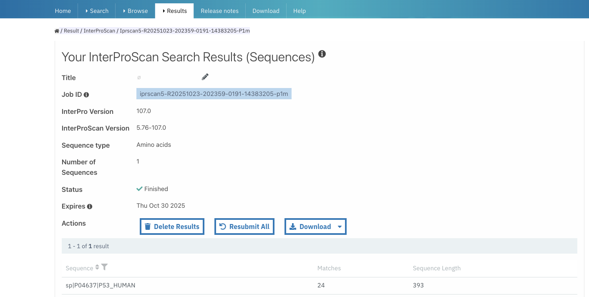
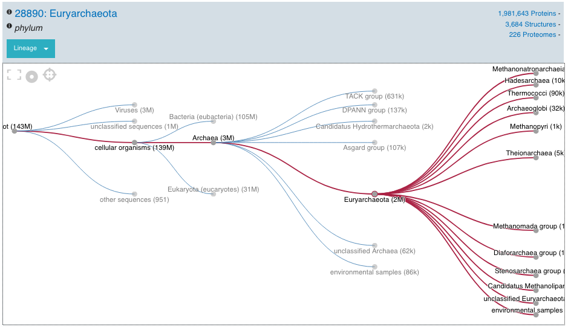

###################################
How to search the InterPro website?
###################################

.. :ref:Search homepage.html#search
.. :ref:navigation_menu banner.html#navigation-menu
.. :ref:navigation_banner banner.html#navigation-banner
.. :ref:memberdb_page browse.html#memberdb-page
.. :ref:entry_page browse.html#entry-page
.. :ref:protein_page browse.html#protein-page
.. :ref:structure_page browse.html#structure-page
.. :ref:taxonomy_page browse.html#taxonomy-page
.. :ref:entry_types entries_info.html#entry-types

A search can be performed on the :doc:`/homepage` using the :ref:`Search` component, by clicking on the Search tab in the 
:ref:`navigation menu <navigation_menu>`, 
or by clicking on the magnifying glass in the :ref:`navigation banner <navigation_banner>`. 
There are five different types of search available in InterPro:

- :ref:`quick_search`
- :ref:`sequence_search`
- :ref:`text_search`
- :ref:`domain_arch_search`
- :ref:`browse_feature`

.. _quick_search:

************
Quick search
************

.. figure:: images/banner/navigation_search_box.png
  :alt: Quick search component
  :width: 200px
  :align: left

The magnifying glass in the navigation banner allows a quick search for a specified keyword. 
A search can be triggered by entering some text and pressing the enter/return key or clicking 
the magnifying glass. If the keyword is text, the results will be displayed as described in 
the :ref:`text_search`. If the keyword entered is an accession, it automatically redirects to the 
corresponding :doc:`InterPro page </browse>` under the **Browse** tab in the :ref:`navigation menu <navigation_menu>`. 

.. _sequence_search:

***************
Sequence search
***************

A sequence or a batch of sequences of nucleotides or amino acids can be submitted in FASTA format in the 
dedicated text area or by uploading a fasta file. The **Advanced options** allows users to select the 
sequence type (protein -amino acids-, or RNA/DNA -nucleotides-), the InterPro member databases and other 
sequence features of interest 
to search against (by default they are all selected). The sequence search is performed using the 
:doc:`InterProScan software </interproscan>`. While the sequence search is running, the user can continue 
to navigate through the website, other browser tabs or applications and will get a pop-up notification 
when the job has been completed (this requires the browser notifications to be allowed).

.. figure:: images/search/seq.png
  :alt: Sequence search component
  :width: 800px

.. _sequence_search_results:

Sequence search results
=======================

Accessing results
-----------------
Protein sequence search results can be found under the **Results** tab within the **Your InterProScan Searches** section of the navigation menu. This page presents sequence searches performed within the past seven days, with the most recent searches appearing at the top of the list.

Search status and management
----------------------------
The **Status** column provides information about the search state through visual indicators. A green tick symbol indicates a completed search, whilst a searching symbol shows an in-progress search. A file symbol denotes either locally saved searches or imported results. Users can manage their searches through the **Action** column, which provides options to delete searches (bin icon) or save them locally (file icon).

.. figure:: images/search/interpro_rtd_list_jobs.png
   :alt: Sequence search list
   :width: 800px

   Summary of sequence searches.

Importing previous searches
---------------------------
Users can import previous searches through two methods. The first method involves entering the job ID for searches conducted within the last seven days on InterPro servers. Alternatively, users can upload an InterProScan output file in JSON format. When importing nucleotide sequence searches, the system creates separate job results for each Open Reading Frame (ORF), with ORFs from the same sequence automatically grouped together. This feature is particularly useful for users requiring InterProScan graphic output formats for publications and other purposes.

Search results summary
----------------------
Selecting a job ID or entry in the **Results** column reveals detailed information 
about the search, including the sequence type, number of sequences analysed, current 
status, and expiry date. Users can perform several actions on their search results. 
The **Resubmit All** button allows running searches again using the latest InterProScan 
version. The search results can also be downloaded in different formats. Besides, job 
results are automatically saved in the browser.

   InterProScan search results (Sequences) page.

Result export options
---------------------
Search results can be exported using the **Download** button. Within the first seven days, users can choose from multiple format options including TSV, JSON, XML, and GFF. For searches saved locally after the seven-day period, results remain available in JSON format only.

Sequence viewer interface
-------------------------
The sequence viewer displays the full-length sequence as a grey bar at the top of the interface, followed by InterPro matches organised into categories such as Families, Domains, and Conserved residues. Users can choose between two display modes: Summary View and Full View. The Summary View presents a condensed overview showing Families, a simplified domain representation, and Conserved sites, whilst the Full View reveals all available annotations.

Match visualisation
-------------------
Each match in the viewer is represented by colour-coded bars indicating protein families, domains, or important sites. When a signature has been integrated into an InterPro entry, the entry appears above its contributing database signatures, on the right-hand side of the viewer. Non-integrated database signatures have the **Unintegrated** label displayed on the right-hand side of the viewer. InterProScan does not specify signature types for unintegrated signatures. When a signature lacks a consistent type and is not integrated into an InterPro entry, it is displayed in the **Unintegrated** category.

Additional features and annotations
-----------------------------------
The viewer includes conserved residue annotations, signal peptide and Transmembrane region information when available. Below the sequence viewer, users can find GO terms associated with matching InterPro entries and PANTHER signatures. The GO terms are assigned manually to InterPro entries using on the `Gene Ontology <http://geneontology.org/>`_ and provide insights into the protein's biological process, molecular function, and cellular location.

Example of a protein sequence analysis
--------------------------------------
Let's imagine you would like to analyse the following protein sequence:

.. Example protein used: P02936

.. code-block:: json

   >my_protein
   MKKTAIAIAVALAGFATVAQAAPKDNTWYAGAKLGWSQYHDTGFIHNDGPTHENQLGAGAFGGYQVNPYVGFEMGYDWLG
   RMPYKGDNINGAYKAQGVQLTAKLGYPITDDLDVYTRLGGMVWRADTKSNVPGGPSTKDHDTGVSPVFAGGIEYAITPEI
   ATRLEYQWTNNIGDANTIGTRPDNGLLSVGVSYRFGQQEAAPVVAPAPAPAPEVQTKHFTLKSDVLFNFNKSTLKPEGQQ
   ALDQLYSQLSNLDPKDGSVVVLGFTDRIGSDAYNQGLSEKRAQSVVDYLISKGIPSDKISARGMGESNPVTGNTCDNVKP
   RAALIDCLAPDRRVEIEVKGVKDVVTQPQA

The sequence viewer reveals several InterPro entries including two families (F), three domains (D), and two homologous superfamilies (H). The first family entry contains signatures from both Prosite (PR01022) and HAMAP (MF_00842), whilst subsequent entries show various combinations of database signatures. The protein contains two domains: an N-terminal OmpA_membrane and a C-terminal OMPA_2. To learn more about each domain's function, hover over it to display a tooltip and click the InterPro accession. Additional features include N-terminal signal peptide identification and specific conserved residue annotations towards the C-terminal, provided by CDD.

.. figure:: images/search/sequence_search_result.png
   :alt: Sequence search viewer
   :width: 800px

   Sequence viewer displaying the results of the sequence search.

.. _text_search:

***********
Text search
***********

The text search is available by selecting the “By Text” section under the **Search** tab in the website menu. 
The text search allows to search the following information in the database:

- Name or keyword (e.g. `Afadin <https://www.ebi.ac.uk/interpro/search/text/Afadin/?page=1#table>`_)
- InterPro accession (e.g. `IPR000562 <https://www.ebi.ac.uk/interpro/search/text/IPR000562/?page=1#table>`_)
- Member database signature accession (e.g. `PF00040 <https://www.ebi.ac.uk/interpro/search/text/PF00040/?page=1#table>`_)
- Protein accession (e.g. `P04937 <https://www.ebi.ac.uk/interpro/search/text/P04937/?page=1#table>`_) or identifier/short name (e.g. `FINC_RAT <https://www.ebi.ac.uk/interpro/search/text/FINC_RAT/?page=1#table>`_)
- PDB structure (e.g. `6AR9 <https://www.ebi.ac.uk/interpro/search/text/6AR9/?page=1#table>`_)
- Gene name (e.g. `BRCA2 <https://www.ebi.ac.uk/interpro/search/text/BRCA2/?page=1#table>`_)
- GO terms (e.g. `GO:0005911 <https://www.ebi.ac.uk/interpro/search/text/GO:0005911/?page=1#table>`_)
- Proteome accession (e.g. `UP000000304 <https://www.ebi.ac.uk/interpro/search/text/UP000000304/?page=1#table>`_)
- Taxonomy accession (e.g. `7240 <https://www.ebi.ac.uk/interpro/search/text/7240/?page=1#table>`_)
- Set/Clan accession (e.g. `CL0451 <https://www.ebi.ac.uk/interpro/search/text/CL0451/?page=1#table>`_)

Entering a **name**, or **keywords**, retrieves a list of all the InterPro entries and InterPro member database 
signatures that contain these searched words in their title or description. By default the term searched is highlighted 
in the results list and the description is shortened, clicking on the |toggle| symbol located on the left hand side of 
the **Export** button removes the highlight and shows the full description text. The setting is saved and also applied 
to other text searches throughout the website.

Entering an **accession number** gives an exact match and a quick 
access to the corresponding InterPro page. It also displays the list of the InterPro entries and any member 
database signatures linked to that accession number/identifier.

Selecting the accession number or name of any entry in the list of entries opens the corresponding InterPro page 
(e.g. :ref:`member database signature <memberdb_page>`, :ref:`InterPro entry <entry_page>`). An overview of the entry 
is provided and tabs on the left hand-side menu allow specific information for the entry to be viewed, for example the species 
in which a protein has been found, or structures matching an entry. More information on the
:doc:`browsing an InterPro page </browse>` section.

.. _domain_arch_search:

**************************
Domain architecture search
**************************

.. figure:: images/search/ida.png
  :alt: Domain Architecture search
  :width: 800px

This search option allows the retrieval of protein sequences that contain specific Pfam/InterPro domains 
in a particular arrangement referred to as a "domain architecture". For example, protein sequences 
containing both a SH2 domain and SH3 domain can be retrieved. Domains that the proteins should or 
should not contain can be included or excluded from the domain architecture respectively.  
Selecting "**Order of domain matters**" offers the possibility to arrange the domains in a particular order. 
Selecting "**Exact match**" performs the search to find proteins containing the selected domains only 
(no extra domain in the proteins). Domains can be selected by entering a domain name, a Pfam accession, 
or an InterPro accession if a Pfam entry is integrated in it.

Once a search is performed the corresponding results are displayed below the search component and show 
the number of proteins followed by the corresponding domain architecture. For each domain architecture,
the domain size is displayed based on the real length of the domain, using a protein of reference. 
When hovering over a domain, more details are available in a tooltip, including the domain's position. 
Clicking on the number of proteins redirects to the **Browse** tab in the :ref:`navigation menu <navigation_menu>` 
under the protein section, showing the list of proteins which can be filtered to a specific member database, 
if required, as described in the :ref:`browse feature <browse_feature>`.

By default, Pfam entries are shown in the results. This can be changed to show InterPro entries by toggling the 
Pfam checkbox to InterPro and vice versa.

The domain architectures can be downloaded in JSON and TSV formats through the **Export** button.

.. _browse_feature:

**************************************************
Using Browse feature to search and filter InterPro
**************************************************

.. figure:: images/search/browse_page.png
  :alt: Browse search
  :width: 800px

The browse search page can be accessed by clicking on the Browse tab in the :ref:`navigation menu <navigation_menu>`. 
The browse search provides a powerful functionality to select subsets of data available in InterPro by 
selecting filters according to the results required. For example, this page can be used to browse all 
entries which have a contributing signature from a particular member database e.g. HAMAP, or to retrieve 
all proteins from a certain taxon, e.g. *Escherichia coli*, that contain a specific domain e.g. OmpA-like domain.

Below we describe how to use the browse search feature:

1. Select a data type

The browse page opens up with **7 data types** to allow browsing of InterPro entries, Member databases signatures, 
Proteins, Structures, Taxonomies, Proteomes or Clans/Sets.

.. figure:: images/browse/tabs.png
  :alt: Data types
  :width: 800px

2. Select any additional filters

The filters options displayed for each data type will vary as appropriate.

3. Sort by accession

The lists can be ordered by accession in ascending or descending order by clicking on the arrow on the right side of the column name
**Accession** when browsing by **InterPro**, **Member DB** and **Clan/Set**.

.. _memberdbFilter:

Member database filter
======================

.. figure:: images/browse/memberdb_filter.png
  :alt: Member database filter
  :width: 200px
  :align: left

The "**Select your database**" option is available when Browsing by Member DB, Protein, Structure, Taxonomy and Set.
It allows results to be retrieved from all or a selection of :doc:`InterPro member databases </databases>`. Only the databases that contain 
signatures for the chosen data type are displayed as options. By default all the member databases are selected, expect 
when Browsing by Member DB, where Pfam is the default option selected.

|
|
|
|
|
|

.. _text_filter:

Text filter
===========
The "**Search entries**" box allows results to be filtered to match the text entered. For example, the text could 
be a keyword that might be found in entry names. It also allows specific protein names or taxa to be entered.
By default the term searched is highlighted in yellow in the results list, this can be disabled by clicking on the
|toggle| symbol appearing between the text box and **Export** button once the search has started, the setting is saved and
also applied to other text searches throughout the website.

.. |toggle| image:: images/browse/toggle.png
  :alt: toggle icon
  :width: 15pt

.. _data_type_filters:

Data-type specific filters
==========================

.. _entry_filters:

InterPro entry filters
----------------------
.. figure:: images/browse/entry_filters.png
  :alt: Entry filters
  :width: 200px
  :align: left

When **Browse by InterPro** is selected, three filter types can be applied:

- **InterPro Type**: limits the data in the :ref:`data views <data_views>` to the selected :ref:`entry_types`.
- **GO Terms**: filters by selected GO terms from `InterPro2GO <https://www.ebi.ac.uk/GOA/InterPro2GO>`_.
- **New entries**: shows all the entries or only the entries created or made available in the most recent release.
- **Curation status**, show all the entries or show:

  - **Curated**: entries that have been created by an InterPro curator
  - **AI-generated (unreviewed)**: entries that have been created automatically by Artificial Intelligence
  - **AI-generated (reviewed)**: entries that have been created automatically by Artificial Intelligence for which the content has been verified by an InterPro curator

:doc:`More information about AI-generated content on the InterPro website. <llm_descriptions>`

|
|
|
|
|
|
|
|
|
|
|
|

.. _memberdb_filters:

Member database filters
-----------------------

.. figure:: images/browse/member_db_filters.png
  :alt: Member database filters
  :width: 200px
  :align: left

When **Browse by Member DB** is selected and a member database has been chosen, subsequent filters can be applied:

- **Member Database Entry Type**: select the types of signatures required. This is dependent on the database type selected. For example, if a database contains both domains and family signatures you can filter the results for a specific type.
- **InterPro state**: select all signatures from the selected database or only those signatures that have been integrated into InterPro.
- **Curation status**, show all the signatures or show:

  - **Curated**: signatures for which the name and description have been created by a scientific curator.
  - **AI-generated (unreviewed)**: signatures for which the name and description have been created automatically by Artificial Intelligence.

:doc:`More information about AI-generated content on the InterPro website. <llm_descriptions>`

|
|
|
|
|
|
|
|
|
|
|
|

Protein filters
---------------
Just as with the :ref:`Member DB <memberdb_filters>` data type, **Protein** filters change based on the selection in the 
:ref:`member database filter <memberdbFilter>` component. The basic filters are displayed irrespective of the 
selection made and an extra filter when the "**All Proteins**" option is selected.

.. figure:: images/browse/proteins_filter.png
  :alt: Proteins filters
  :width: 200px
  :align: left

Database selected
^^^^^^^^^^^^^^^^^

If a member database has been selected, the following filters are displayed:

- **UniProt Curation**: the `UniProtKB <https://www.uniprot.org/help/uniprotkb>`_ is split into two sections. The reviewed set is manually curated (SwissProt) and the unreviewed set is derived from public databases automatically integrated into UniProt (TrEMBL).
- **Taxonomy**: this filter allows the displayed list of proteins to be limited to certain organisms.
- **Sequence Status**: this filter allows proteins to be limited to complete proteins or fragments.

All Proteins
^^^^^^^^^^^^

.. figure:: images/browse/all_proteins_filter.png
  :alt: Matching entries filter
  :width: 200px
  :align: right

Additionally to the filters mentioned above, when the "**All Proteins**" option is selected in the 
:ref:`member database filter <memberdbFilter>` component, the **Matching Entries** filter is displayed. 
This filter allows the selection of proteins which do or do not contain matches to entries in the InterPro dataset.

|
|

Structure filters
-----------------
.. figure:: images/browse/structure_filter.png
  :alt: Structure filters
  :width: 200px
  :align: left
  
Structure filters do not vary depending on which option has been selected in the 
:ref:`member database filter <memberdbFilter>` component.

- **Experiment Type**: this filter allows selection of structures based on the type of experimental data the structure is based on.
- **Resolution**: this filter allows structures to be selected based on the resolution of the structure.

|
|
|
|
|

.. _data_views:

Data Display Options 
====================
The data display is the main part of the results section in the browse page and shows the data selected in the 
:ref:`data type menu <data_type_filters>`. The actual details shown will also be dependent on the selected data type. 

.. figure:: images/browse/data_view.png
  :alt: Data views
  :width: 350px

Tabular view
------------
.. figure:: images/browse/tabular.png
  :alt: Tabular icon
  :width: 100px
  :align: left
The tabular view is the default view and is available for all :ref:`InterPro data types <browse_feature>`. 
The table view icon formats data into a tabular view composed of rows representing individual entities. The table header 
describes the contents of each column. Clicking on one of the rows redirects to the corresponding :doc:`InterPro page </browse>`.

.. figure:: images/browse/entry_data.png
  :alt: Tabular entry view
  :width: 800px

  Tabular view example for InterPro entry data type

Grid view
---------

.. figure:: images/browse/grid.png
  :alt: Grid icon
  :width: 100px
  :align: left
The grid view is available for all :ref:`InterPro data types <browse_feature>`. It displays a series of cards 
summarising details of the entities being viewed. Clicking on one of the cards redirects to the corresponding 
:doc:`InterPro page </browse>`.

.. figure:: images/browse/entry_grid.png
  :alt: Grid entry view
  :width: 800px

  Grid view example for InterPro entry data type

Tree view
---------
.. figure:: images/browse/tree.png
  :alt: Tree icon
  :width: 100px
  :align: left

The tree view is currently only enabled for taxonomy data. The tree view icon is only shown where a tree view is 
possible.
The taxonomy tree viewer can be navigated by clicking on nodes or using keyboard arrow keys. This component is 
also used in the :ref:`taxonomy_page`.

  Tree view example for Euryarchaeota phylum
