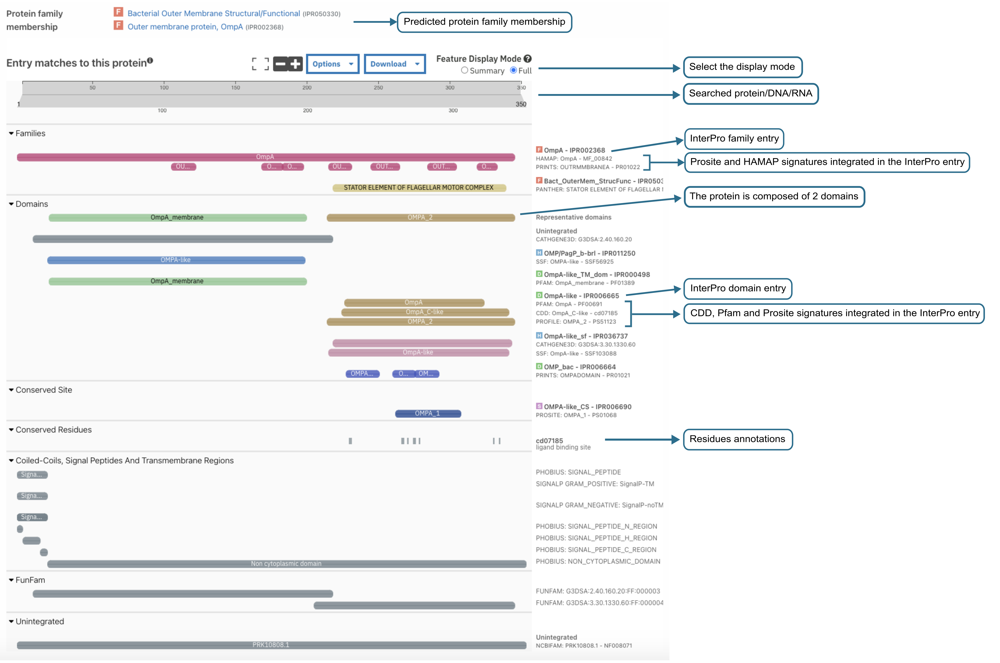
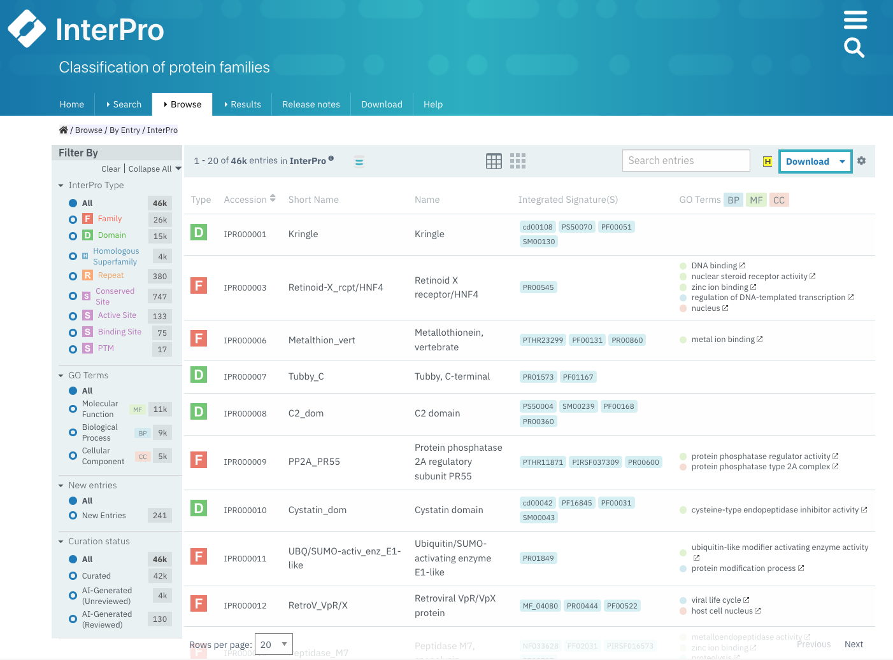
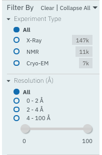

###########
How to search the InterPro website?
###########

.. :ref:Search homepage.html#search
.. :ref:navigation_menu banner.html#navigation-menu
.. :ref:navigation_banner banner.html#navigation-banner
.. :ref:memberdb_page browse.html#memberdb-page
.. :ref:entry_page browse.html#entry-page
.. :ref:protein_page browse.html#protein-page
.. :ref:structure_page browse.html#structure-page
.. :ref:taxonomy_page browse.html#taxonomy-page
.. :ref:entry_types entries_info.html#entry-types

A search can be performed on the :doc:`/homepage` using the :ref:`Search` component, by clicking on the Search tab in the 
:ref:`navigation menu <navigation_menu>`, 
or by clicking on the magnifying glass in the :ref:`navigation banner <navigation_banner>`. 
There are five different types of search available in InterPro:

- :ref:`quick_search`
- :ref:`sequence_search`
- :ref:`text_search`
- :ref:`domain_arch_search`
- :ref:`browse_feature`

.. _quick_search:

**************
Quick search
**************

.. figure:: images/banner/navigation_search_box.png
  :alt: Quick search component
  :width: 200px
  :align: left

The magnifying glass in the navigation banner allows a quick search for a specified keyword. 
A search can be triggered by entering some text and pressing the enter/return key or clicking 
the magnifying glass. If the keyword is text, the results will be displayed as described in 
the :ref:`text_search`. If the keyword entered is an accession, it automatically redirects to the 
corresponding :doc:`InterPro page </browse>` under the **Browse** tab in the :ref:`navigation menu <navigation_menu>`. 

.. _sequence_search:

***************
Sequence search
***************

A sequence or a batch of sequences can be submitted in FASTA format in the dedicated text area or by uploading a fasta file. 
The “**Advanced options**” allows users to select the InterPro member databases of interest to search 
against (by default they are all selected). The sequence search is performed using the 
:doc:`InterProScan software </interproscan>`. While the sequence search is running, the user can continue 
to navigate through the website, other browser tabs or applications and will get a pop-up notification 
when the job has been completed (this requires the browser notifications to be allowed).

.. figure:: images/search/seq.png
  :alt: Sequence search component
  :width: 800px

.. _sequence_search_results:

Sequence search results
=======================
Results of a protein sequence search are available under the **Results** tab in the navigation menu under 
**Your InterProScan Searches** section. This page displays the protein sequence searches you have 
performed in the last seven days, with the most recent one being displayed at the top. The status 
column gives an indication of whether or not the search has completed (green tick symbol / searching), if the 
search has been saved locally (the results will still be available even after the seven days limit set up on 
InterPro servers), or if the results have been imported (file symbol). 
Clicking on the job id or on the text in the results column opens a page where the results are summarised in a 
protein sequence viewer (more detailed information is provided for the :doc:`/protein_viewer`).

Previously ran searches can be imported either by typing the job ID in the **Import** text box, for searches 
performed in the last seven days on our servers, or by uploading an :doc:`InterProScan </interproscan>` output 
file in JSON format, the job is added to the Results table. If the second option is choosen and InterProScan was 
run using nucleotide sequences, a job result is created for each Open Reading Frame (ORF) and ORFs from the same 
nucleotide sequence are grouped accordingly. 
This import feature can be used by users requiring to have InterProScan graphic output formats for publications 
and other uses.

When a search has been run using a previous version of InterProScan, it can be re-run using the latest 
version of the software.
When a batch of sequences has been submitted, group actions allow to Delete All, Re-run All, and Download All the 
submitted sequences at once.

.. figure:: images/search/InterPro_rtd_list_jobs.png
  :alt: Sequence search result
  :width: 800px

  Summary of sequence searches jobs.

  Example of protein sequence viewer as displayed in the search result page.

On the search results page, some general information on the submitted sequence is provided, 
followed by the predicted InterPro protein family membership when available ([1] in the figure above).
The search can be saved by clicking on the **Save in Browser** button. The status will be changed to "**Imported file**".
This means that the results will be available behind the usual seven days limit on the browser and machine the save 
has been done, and will only be deleted if the user deletes the job by clicking on the bin icon.

The sequence submitted is shown in its full length at the top of the protein sequence viewer (grey bar) [2]. 
This is followed below by InterPro entries and signatures matches, displayed in categories classified by :ref:`entry_types`. 
Each coloured bar represents a domain, protein family, or important site that has been 
matched to part or all the length of the submitted protein sequence. 

- The top coloured bar represents the InterPro entry [3a, 4a].
- Directly below the InterPro entry, additional coloured bars display the member database signatures that contributed to that InterPro entry [3b, 4b]. 

In the example above, four InterPro entries (1 family and 3 domain entries) have been found matching the 
submitted sequence. The first InterPro entry is for a protein family [3a], containing two member database 
signatures, in this case from Prosite (PR01022) and HAMAP (MF_00842)[3b]. The following three InterPro matches are domains. 
The top InterPro domain entry [4a] contains signatures from 3 member databases (Pfam, CDD and Prosite) 
[4b] which all represent the same domain. The remaining two InterPro domains contain one member database signature.

Looking at the **Other features** section, we also learn that the protein has a signal peptide at its N-terminal end.
CDD also provides per residue annotations which are displayed in the corresponding category at the bottom of the viewer [5].

Additionally to the InterPro matches, information about the GO terms associated to the InterPro entries and PANTHER signatures matching the protein 
are displayed below the sequence viewer when available. The GO terms are assigned manually to InterPro entries using on 
the `Gene Ontology <http://geneontology.org/>`_ and reflect the Biological process, Molecular function or Cellular location the protein may have.

.. _text_search:

***********
Text search
***********

The text search is available by selecting the “**text search**” section under the Search tab in the website menu. 
The text search will search the following information in the database:

- name, keyword
- InterPro, protein, protein structure or member database signature accession
- Protein identifier
- Gene identifier 
- GO terms
- proteome identifier
- set identifier

Entering a **name**, or **keywords**, retrieves a list of all the InterPro entries and InterPro member database 
signatures that contain these searched words in their title or description. By default the term searched is highlited 
in the results list and the description is shortened, clicking on the |toggle| symbol located on the left hand side of 
the **Export** button removes the highlight and shows the full description text. The setting is saved and also applied 
to other text searches throughout the website.

Entering an **accession number** or an **identifier**  (e.g. IPR020422 (InterPro), O00167 (UniProt), PF02932 (member database), 
GO\:0007165 (GO term), 1t2v (structure), UP000005640 (proteome), 	cl00011 (set), A4 (gene)) gives an exact match and a quick 
access to the corresponding InterPro page. It also displays the list of the InterPro entries and any member 
database signatures linked to that accession number/identifier.

Selecting the accession number or name of any entry in the list of entries opens the corresponding InterPro page 
(e.g. :ref:`member database signature <memberdb_page>`, :ref:`InterPro entry <entry_page>`) under the **Browse** tab 
in the :ref:`navigation menu <navigation_menu>`. An overview of the entry 
is provided and tabs on the left hand-side menu allow specific information for the entry to be viewed, for example the species 
in which a protein has been found, or structures matching an entry. More information on the
:doc:`browsing an InterPro page </browse>` section.

.. _domain_arch_search:

*******************
Domain architecture search
*******************

.. figure:: images/search/ida.png
  :alt: Domain Architecture search
  :width: 800px

This search option allows the retrieval of protein sequences that contain specific Pfam/InterPro domains 
in a particular arrangement referred to as a "domain architecture". For example, protein sequences 
containing both a SH2 domain and SH3 domain can be retrieved. Domains that the proteins should or 
should not contain can be included or excluded from the domain architecture respectively.  
Selecting "**Order of domain matters**" offers the possibility to arrange the domains in a particular order. 
Selecting "**Exact match**" performs the search to find proteins containing the selected domains only 
(no extra domain in the proteins). Domains can be selected by entering a domain name, a Pfam accession, 
or an InterPro accession if a Pfam entry is integrated in it.

Once a search is performed the corresponding results are displayed below the search component and show 
the number of proteins followed by the corresponding domain architecture. For each domain architecture,
the domain size is displayed based on the real length of the domain, using a protein of reference. 
When hovering over a domain, more details are available in a tooltip, including the domain's position. 
Clicking on the number of proteins redirects to the **Browse** tab in the :ref:`navigation menu <navigation_menu>` 
under the protein section, showing the list of proteins which can be filtered to a specific member database, 
if required, as described in the :ref:`browse feature <browse_feature>`.

By default, Pfam entries are shown in the results. This can be changed to show InterPro entries by toggling the 
Pfam checkbox to InterPro and vice versa.

.. _browse_feature:

*******************
Using Browse feature to search and filter InterPro
*******************

The browse search page can be accessed by clicking on the Browse tab in the :ref:`navigation menu <navigation_menu>`. 
The browse search provides a powerful functionality to select subsets of data available in InterPro by 
selecting filters according to the results required. For example, this page can be used to browse all 
entries which have a contributing signature from a particular member database e.g. HAMAP, or to retrieve 
all proteins from a certain taxon, e.g. *Escherichia coli*, that contain a specific domain eg OmpA-like domain.

Below we describe how to use the browse search feature:

1. Select a data type

The browse page opens up with **7 data types** to allow browsing of InterPro entries, Member databases signatures, 
Proteins, Structures, Taxonomies, Proteomes or Sets.

2. Select any additional filters

The filters options displayed for each data type will vary as appropriate.

.. _memberdbFilter:

Member database filter
======================

.. figure:: images/browse/memberdb_filter.png
  :alt: Member database filter
  :width: 200px
  :align: left

The "**Select your database**" option is available when Browsing by Member DB, Protein, Structure, Taxonomy and Set.
It allows results to be retrieved from all or a selection of :doc:`InterPro member databases </databases>`. Only the databases that contain 
signatures for the chosen data type are displayed as options. By default all the member databases are selected, expect 
when Browsing by Member DB, where Pfam is the default option selected.

|
|
|
|
|
|
|
|
|
|

.. _text_filter:

Text filter
===========
The "**Search entries**" box allows results to be filtered to match the text entered. For example, the text could 
be a keyword that might be found in entry names. It also allows specific protein names or taxa to be entered.
By default the term searched is highlighted in yellow in the results list, this can be disabled by clicking on the
|toggle| symbol appearing between the text box and **Export** button once the search has started, the setting is saved and
also applied to other text searches throughout the website.

.. _data_type_filters:

Data-type specific filters
==========================

.. _entry_filters:

InterPro entry filters
-------------

When **Browse by InterPro** is selected, two filter types can be applied:

- **InterPro Type**: limits the data in the :ref:`data views <data_views>` to the selected :ref:`entry_types`.
- **Go Terms**: filters by selected Go terms from `InterPro2GO <https://www.ebi.ac.uk/GOA/InterPro2GO>`_.

|
|
|
|
|
|
|
|
|
|
|
|
|

.. _memberdb_filters:

Member database filters
-------------

.. figure:: images/browse/member_db_filters.png
  :alt: Member database filters
  :width: 200px
  :align: left

When **Browse by Member DB** is selected and a member database has been chosen, subsequent filters can be applied:

- **Member Database Entry Type**: select the types of signatures required. This is dependent on the database type selected. For example, if a database contains both domains and family signatures you can filter the results for a specific type.
- **InterPro state**: select all signatures from the selected database or only those signatures that have been integrated into InterPro. 

|
|
|
|
|
|
|
|
|
|
|
|
|
|
|
|
|
|
|
|
|
|
|

Protein filters
---------------
Just as with the :ref:`Member DB <memberdb_filters>` data type, **Protein** filters change based on the selection in the 
:ref:`member database filter <memberdbFilter>` component. The basic filters are displayed irrespective of the 
selection made and an extra filter when the "**All Proteins**" option is selected.

.. figure:: images/browse/proteins_filter.png
  :alt: Proteins filters
  :width: 200px
  :align: left

Database selected
^^^^^^^^^^^^^^^^^

If a member database has been selected, the following filters are displayed:

- **UniProt Curation**: the `UniProtKB <https://www.uniprot.org/help/uniprotkb>`_ is split into two sections. The reviewed set is manually curated (SwissProt) and the unreviewed set is derived from public databases automatically integrated into UniProt (TrEMBL).
- **Taxonomy**: this filter allows the displayed list of proteins to be limited to certain organisms.
- **Sequence Status**: this filter allows proteins to be limited to complete proteins or fragments.

All Proteins
^^^^^^^^^^^^

.. figure:: images/browse/all_proteins_filter.png
  :alt: Matching entries filter
  :width: 200px
  :align: right

Additionally to the filters mentioned above, when the "**All Proteins**" option is selected in the 
:ref:`member database filter <memberdbFilter>` component, the **Matching Entries** filter is displayed. 
This filter allows the selection of proteins which do or do not contain matches to entries in the InterPro dataset.

|
|

Structure filters
-----------------

  
Structure filters do not vary depending on which option has been selected in the 
:ref:`member database filter <memberdbFilter>` component.

- **Experiment Type**: this filter allows selection of structures based on the type of experimental data the structure is based on.
- **Resolution**: this filter allows structures to be selected based on the resolution of the structure.

|
|
|
|
|

.. _data_views:

Data Display Options 
====================
The data display is the main part of the results section in the browse page and shows the data selected in the 
:ref:`data type menu <data_type_filters>`. The actual details shown will also be dependent on the selected data type. 

.. figure:: images/browse/data_view.png
  :alt: Data views
  :width: 350px

Tabular view
------------
.. figure:: images/browse/tabular.png
  :alt: Tabular icon
  :width: 100px
  :align: left
The tabular view is the default view and is available for all :ref:`InterPro data types <browse_feature>`. 
The table view icon formats data into a tabular view composed of rows representing individual entities. The table header 
describes the contents of each column. Clicking on one of the rows redirects to the corresponding :doc:`InterPro page </browse>`.

.. figure:: images/browse/entry_data.png
  :alt: Tabular entry view
  :width: 800px

  Tabular view example for InterPro entry data type

Grid view
---------

.. figure:: images/browse/grid.png
  :alt: Grid icon
  :width: 100px
  :align: left
The grid view is available for all :ref:`InterPro data types <browse_feature>`. It displays a series of cards 
summarising details of the entities being viewed. Clicking on one of the cards redirects to the corresponding 
:doc:`InterPro page </browse>`.

.. figure:: images/browse/entry_grid.png
  :alt: Grid entry view
  :width: 800px

  Grid view example for InterPro entry data type

Tree view
---------
.. figure:: images/browse/tree.png
  :alt: Tree icon
  :width: 100px
  :align: left

The tree view is currently only enabled for taxonomy data. The tree view icon is only shown where a tree view is 
possible.
The taxonomy tree viewer can be navigated by clicking on nodes or using keyboard arrow keys. This component is 
also used in the :ref:`taxonomy_page`.

.. figure:: images/browse/taxonomy_tree.png
  :alt: Tree view
  :width: 800px

  Tree view example for Euryarchaeota phylum
