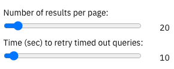
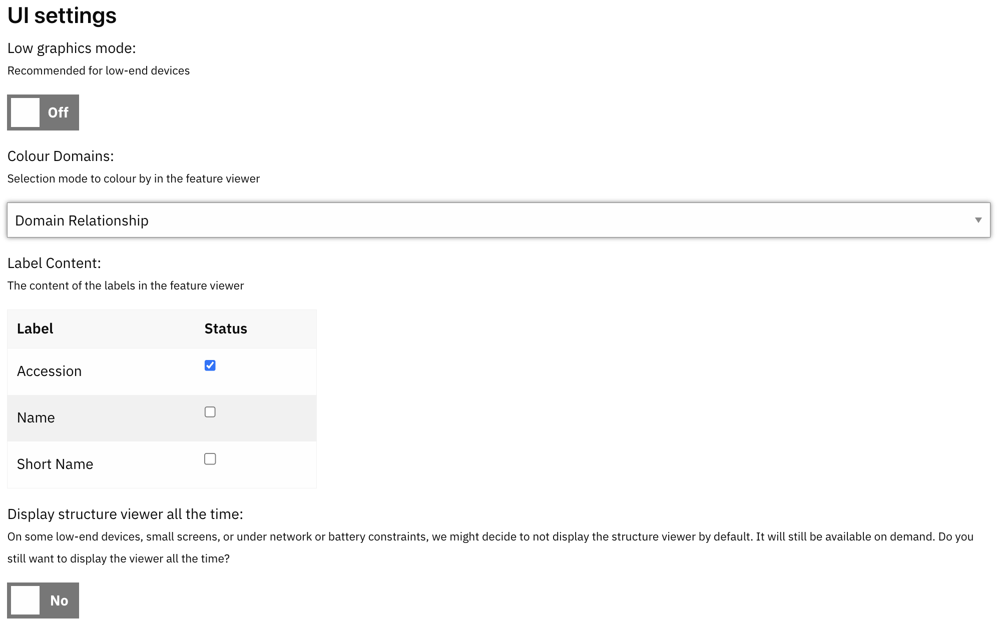
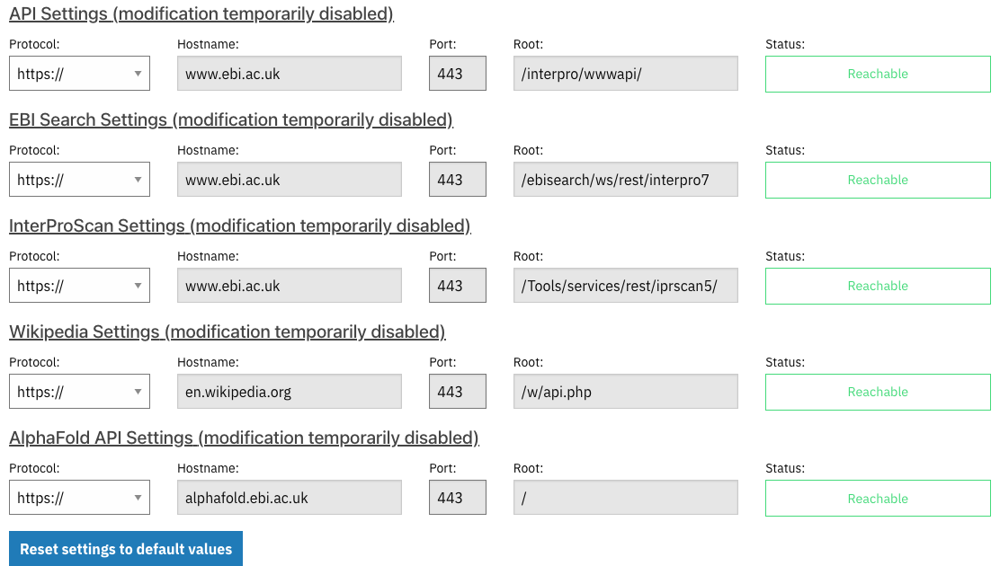

#############
Settings Page
#############

On this page, it is possible to select options that will persist beyond your current browsing session. Your  choices are saved in the browser using a technology called IndexedDB. This allows you, for example, to choose 50 as the number of results to be included on the website data tables, and then this value will be remembered and the next time you visit our website, it will use 50 records for all the data tables.

All the settings are included on the same page and are organised in 7 sections. A menu on the left indicates which section you are currently displaying and allows you to jump directly to the one of your interest.

Navigation settings
========================

- **Number of results per page**: Choose how many items should be listed in all the website data tables. The default is 20, we recommend using 20, 50, or 100 in order to get a more significant benefit from the server caching strategy.
- **Time (sec) to retry timed out queries**: Certain combinations of filters can create expensive, non-previously cached API queries. When the InterPro API times out, it keeps processing the query and once it is resolved, saves the result in the cache for future requests. This setting defines how long to wait before checking again if the result is ready, the default value is 10 seconds.

Notification settings
========================

.. figure:: images/settings/settings-3-notifications.png
  :alt: The Notification settings

- **Browser notifications**: this type of notifications are native to your browser, they allow the display of a notification outside the page. It is useful, for example, to let you know when an InterProScan search is completed. You can enable them by clicking the "Enable notifications" button. Unfortunately, we are not able to show a disable button because that change needs to be done from the setting of your browser directly.
- **Help tooltips**: in-page tooltip notifications try to make more visible parts or functions of the website that we think are not so obvious like this setting page, for example. These parameters allow you a granular selection of which tips will be enabled or disabled.

User interface settings
========================

- **Low graphics mode**: if you are visiting the InterPro website from a not too powerful device, you might benefit from selecting low graphics mode, which disables some animations and other visual effects that might cause poor performance on low-end devices.
- **Colour Domains**: defines the colouring strategy for the Protein sequence viewer. There are 3 options: 
- **Accession**: a unique colour for each accession in the graphic.
- **Member database**: all entries of the same member database will have the same colour.
- **Domain relationship**: InterPro entries will follow the accession strategy, but integrated signatures will be painted in the same colour as the linked InterPro entry.
- **Label Content**: applies to the Protein sequence viewer and the set's visualisation. You can choose the content of the labels of each entry by selecting at least 1 label from accession, name, or short name.
- **Display structure viewer all the time**: on some low-end devices, small screens, or under network or battery constraints, we might decide to not display the structure viewer by default. It will still be available on demand. With this option, you can set it to always display the viewer.

Cache settings
========================

In order to speed up the website we keep a local cache in your browser. It includes the API responses, since the last release of InterPro, and it gets dropped when a new version is released. You can disable the cache or clear it if, for instance, you think it is corrupted and is not displaying the latest data.

Server settings
========================

To get all the data displayed, the InterPro website queries different API servers. Although the values in this section are read-only in the current version of the website, the information can be useful to identify any data errors on the website.

Developer Information
========================
Information on the current build of the website. It is read-only but can help to investigate any errors in the website. 

